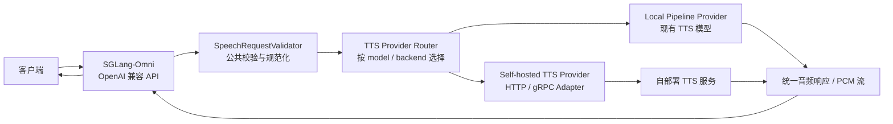
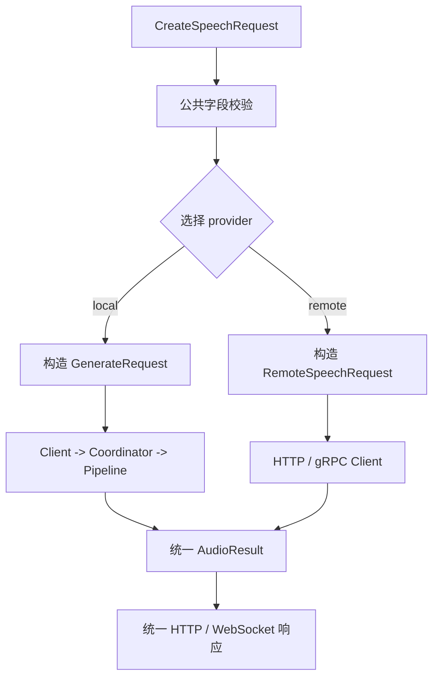
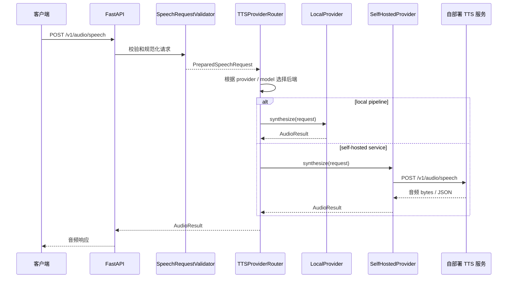
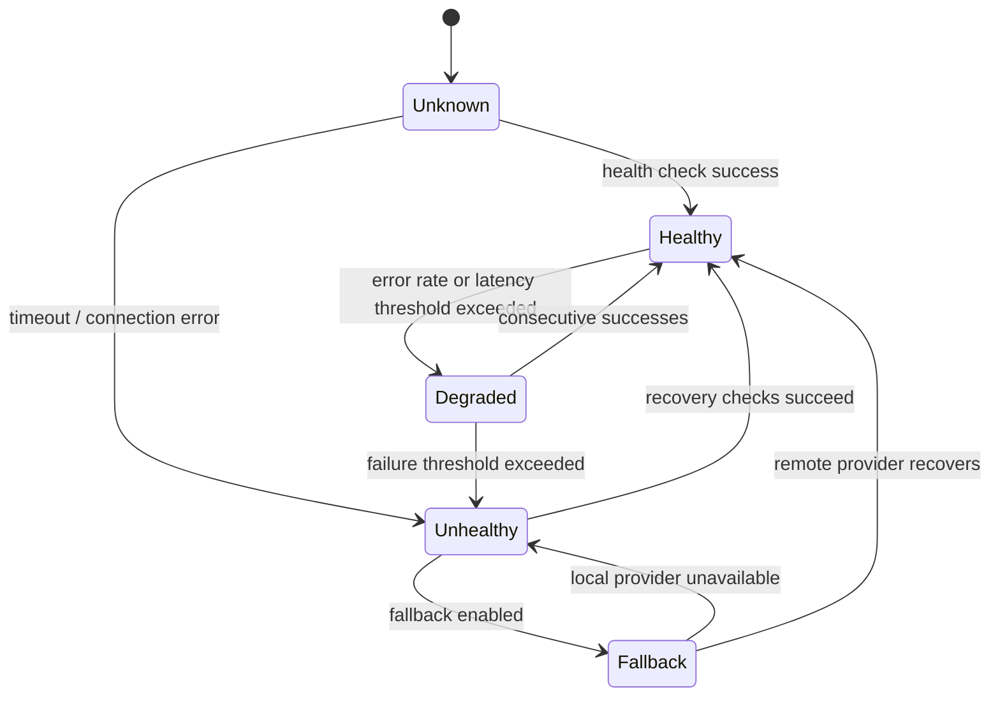
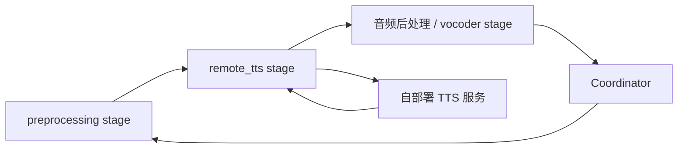

# 自部署 TTS 服务集成方案

本文说明如何将已有的自部署 TTS 服务作为 SGLang-Omni 的一个可选后端接入，同时保留项目现有的本地 TTS Pipeline。

## 1. 目标与推荐结论

假设已有 TTS 服务独立运行，能够通过 HTTP 或 gRPC 接收文本和语音参数，并返回完整音频或流式音频。推荐采用两阶段方案：

1. **第一阶段：Provider 适配器模式**
   - SGLang-Omni 继续负责 OpenAI 兼容入口、参数校验、鉴权和统一响应。
   - 新增一个远程 TTS provider，将标准 speech request 转换为自部署服务的请求。
   - 自部署 TTS 服务继续负责模型加载、GPU、batch、vocoder 和模型生命周期。

2. **第二阶段：Pipeline Stage 模式（按需）**
   - 只有在需要把外部服务纳入 Coordinator、统一流式路由、跨阶段调度或统一 benchmark 时，才把它包装成独立 stage。
   - 不建议一开始将一个已经独立部署的服务强行重写为 SGLang-Omni 模型 stage。

推荐的第一阶段结构如下：



## 2. 为什么采用 Provider 层

当前 `/v1/audio/speech` 的处理链路已经包含：

```text
HTTP Request
    -> SpeechRequestValidator
    -> GenerateRequest
    -> Client.speech
    -> Coordinator
    -> Local Pipeline
    -> Vocoder
    -> Audio Response
```

相关代码：

- `sglang_omni/serve/openai_api.py`：HTTP、批量和 WebSocket 路由。
- `sglang_omni/serve/protocol.py`：`CreateSpeechRequest` 等公共请求协议。
- `sglang_omni/serve/speech_service.py`：请求校验、参考音频处理和内部请求构造。
- `sglang_omni/client/client.py`：本地 Pipeline 请求发送、音频聚合和格式编码。

远程 TTS 不一定拥有 SGLang-Omni 的 `Coordinator`、`StagePayload` 或 SGLang scheduler。如果直接把远程服务伪装成一个本地模型 stage，会引入不必要的进程、GPU 和 payload 管理成本。

Provider 层可以把“选择后端”和“调用后端”从本地 Pipeline 中解耦：



## 3. Provider 接口设计

建议增加模型无关的 provider 接口，例如：

```python
from collections.abc import AsyncIterator
from dataclasses import dataclass
from typing import Any


@dataclass
class AudioResult:
    audio_bytes: bytes
    mime_type: str
    format: str
    sample_rate: int | None = None
    usage: dict[str, Any] | None = None


@dataclass
class AudioChunk:
    data: bytes
    sample_rate: int | None = None
    is_final: bool = False


class TTSProvider:
    async def synthesize(
        self,
        request: CreateSpeechRequest,
        *,
        request_id: str,
    ) -> AudioResult:
        raise NotImplementedError

    async def stream(
        self,
        request: CreateSpeechRequest,
        *,
        request_id: str,
    ) -> AsyncIterator[AudioChunk]:
        raise NotImplementedError

    async def health(self) -> dict[str, Any]:
        raise NotImplementedError

    async def close(self) -> None:
        raise NotImplementedError
```

建议的实现目录：

```text
sglang_omni/serve/tts/
├── __init__.py
├── base.py                 # TTSProvider、AudioResult、AudioChunk
├── router.py               # provider 选择和能力查询
├── local.py                # 当前 Client / Pipeline 的 provider 包装
├── remote_http.py          # 自部署 HTTP TTS 适配器
├── remote_grpc.py          # 可选 gRPC 适配器
├── protocol.py             # 远程服务请求/响应模型
├── health.py               # 健康检查与熔断状态
└── errors.py               # provider 错误映射
```

第一阶段可以只实现 `base.py`、`router.py`、`local.py` 和 `remote_http.py`。

## 4. 远程服务协议适配

### 4.1 推荐的远程 HTTP 合同

如果可以调整自部署服务，优先让它提供接近以下的接口：

```http
POST /health
GET  /v1/models
POST /v1/audio/speech
POST /v1/audio/speech/stream
```

非流式请求示例：

```json
{
  "model": "my-tts",
  "input": "你好，欢迎使用语音服务。",
  "voice": "default",
  "response_format": "wav",
  "speed": 1.0,
  "language": "Chinese",
  "instructions": "自然、清晰、语速适中"
}
```

非流式响应可以有两种形式：

```http
Content-Type: audio/wav
X-Sample-Rate: 24000
X-Request-Id: remote-request-id
```

或者：

```json
{
  "audio": "<base64>",
  "format": "wav",
  "sample_rate": 24000,
  "usage": {
    "generation_time_ms": 182
  }
}
```

建议适配器同时兼容二进制音频和 JSON/base64 响应，但内部统一为 `AudioResult`。

### 4.2 参数映射

| SGLang-Omni 字段 | 远程服务字段 | 处理策略 |
| --- | --- | --- |
| `model` | `model` / URL 路由 | 由 provider 配置覆盖或透传 |
| `input` | `text` / `input` | 必须映射 |
| `voice` | `voice` / `speaker` | 配置别名 |
| `response_format` | `format` / `audio_format` | 适配器转换 |
| `speed` | `speed` | 透传或本地处理 |
| `language` | `language` / `lang` | 别名转换 |
| `instructions` | `style` / `instruction` | 无对应能力时明确拒绝或丢弃 |
| `ref_audio` | `reference_audio` | 发送 data URL、multipart 或对象存储 URL |
| `ref_text` | `reference_text` | 透传 |
| `references` | `references` | 按服务合同转换 |
| `seed` | `seed` | 透传；不支持时返回能力错误 |
| `stage_params` | provider 专属扩展 | 不应直接发送到不可信远端 |

不应把所有 `stage_params` 无条件透传给远程服务。建议只允许 provider 配置声明的字段白名单。

## 5. Provider 选择方式

建议支持三种选择优先级：

```text
请求显式 backend/provider
    > 请求 model 对应的 provider 映射
    > 服务默认 provider
```

例如：

```json
{
  "model": "my-remote-tts",
  "provider": "self_hosted",
  "input": "Hello from the remote TTS service.",
  "voice": "alloy"
}
```

当前 `CreateSpeechRequest` 没有 `provider` 字段。建议新增一个可选字段：

```python
provider: str | None = None
```

为了兼容现有客户端，也可以先使用 `model` 做选择：

```text
model = Qwen/Qwen3-TTS-12Hz-0.6B-Base  -> local
model = my-remote-tts                  -> self_hosted
```

推荐最终同时支持 `provider` 和 `model`，其中 `provider` 表达部署后端，`model` 表达后端中的模型。

## 6. 配置方案

### 6.1 YAML 配置示例

建议新增服务级 TTS 配置，不把远程 URL 塞入模型 `PipelineConfig` 的 stage factory 参数：

```yaml
tts:
  default_provider: local
  providers:
    local:
      type: local_pipeline

    self_hosted:
      type: http
      base_url: http://tts-service:9000
      api_key_env: SELF_HOSTED_TTS_API_KEY
      model: my-tts-v1
      connect_timeout_s: 2
      read_timeout_s: 120
      stream_read_timeout_s: 30
      max_connections: 64
      max_keepalive_connections: 16
      health_path: /health
      speech_path: /v1/audio/speech
      stream_path: /v1/audio/speech/stream
      capabilities:
        streaming: true
        reference_audio: true
        batch: false
        formats: [wav, pcm]
        languages: [Chinese, English]

  model_routes:
    my-remote-tts: self_hosted
    Qwen/Qwen3-TTS-12Hz-0.6B-Base: local
```

如果当前 `PipelineConfig` 不适合扩展服务级字段，可以先使用独立 YAML 文件或 CLI 参数：

```bash
sgl-omni serve \
  --config examples/configs/qwen3_omni.yaml \
  --tts-provider-config configs/tts-providers.yaml
```

不建议把 API key 直接写进 YAML。只保存环境变量名，并在启动时读取实际密钥。

### 6.2 配置校验

启动时应校验：

- `type=http` 必须有 `base_url`。
- URL 必须使用允许的 `http` 或 `https` scheme。
- timeout、连接池大小和重试次数必须为正数。
- `default_provider` 必须存在。
- model route 指向的 provider 必须存在。
- provider 声明的格式和语言必须是公共协议允许的子集。
- 远程服务不支持流式时，不能接受 `stream=true`。

## 7. API 层改造位置

当前 API 路由直接依赖 `Client` 和 `SpeechRequestValidator`。建议把 provider 选择放在二者之间：



推荐的调用关系：

```python
prepared = await speech_service.prepare_request(payload)
provider = tts_router.resolve(
    provider=prepared.request.provider,
    model=prepared.request.model,
)
result = await provider.synthesize(
    prepared.request,
    request_id=request_id,
)
return audio_response(result)
```

为了降低第一次改造风险，可以先抽取现有本地逻辑为 `LocalTTSProvider`，再添加 `HttpTTSProvider`。这样路由层只依赖 provider 接口，现有本地行为可以通过回归测试保护。

## 8. 流式处理方案

### 8.1 HTTP 流式

当前项目要求 HTTP TTS 流式请求使用：

```json
{
  "stream": true,
  "response_format": "pcm"
}
```

远程服务也应返回可增量读取的 PCM 流。推荐使用 NDJSON 或明确的 chunk framing，而不是依赖任意 HTTP chunk 边界：

```text
Content-Type: application/x-ndjson

{"audio_base64":"...","sample_rate":24000,"seq":0,"final":false}
{"audio_base64":"...","sample_rate":24000,"seq":1,"final":false}
{"audio_base64":"...","sample_rate":24000,"seq":2,"final":true}
```

适配器负责：

- 校验序号是否递增。
- 校验 sample rate 是否变化。
- 将远程 chunk 转换为 `AudioChunk`。
- 在客户端断开时取消 HTTP 请求。
- 远程服务异常时发送统一错误并关闭流。

### 8.2 WebSocket 流式

如果自部署服务本身提供 WebSocket，可以在 provider 内维护上游连接；SGLang-Omni 继续对外暴露现有 `/v1/audio/speech/stream`。

如果远程服务只有普通 HTTP 非流式接口，则只能支持非流式 `/v1/audio/speech`，不能通过本地端伪造低延迟流式输出。此时应在 capability 中声明 `streaming=false`，收到流式请求时返回明确错误。

## 9. 批量请求

当前 `/v1/audio/speech/batch` 支持最多 32 个 item，但远程服务未必支持 batch。

建议由 provider 声明：

```text
batch=true  -> 使用远程 batch API
batch=false -> SGLang-Omni 控制并发逐条调用
```

逐条调用时需要：

- 使用受控并发，而不是为每个 item 无限制创建任务。
- 继承原有 item 顺序。
- 单 item 失败不影响其他 item。
- 对 HTTP 429、503 和连接超时进行有限重试。
- 统计每个 item 的 provider latency。

不要把 `/v1/audio/speech/batch` 的并发控制和远程服务内部 batch 混为一谈。前者是 API envelope，后者是后端执行策略。

## 10. 错误、超时与重试

建议建立统一错误映射：

| 远程情况 | 对外错误 |
| --- | --- |
| 连接失败 | `503 service_unavailable` |
| 连接超时 | `504 upstream_timeout` |
| 认证失败 | `502 upstream_authentication_error` 或服务配置错误 |
| 参数不支持 | `400 invalid_request_error` |
| 远程 429 | `429 rate_limit_error` |
| 远程 5xx | `502 upstream_error` |
| 音频响应为空或格式错误 | `502 invalid_upstream_response` |

重试原则：

- 只对连接建立失败、429、部分 5xx 做有限重试。
- 不要重试已经开始返回音频的流式请求。
- 非幂等或带随机 seed 的请求，重试策略必须明确记录。
- 每次重试沿用同一个外部 request id 或生成可关联的 attempt id。
- 默认不做无限重试，避免上游故障时放大流量。

## 11. 健康检查与降级

Provider 的健康状态至少应包括：

```json
{
  "provider": "self_hosted",
  "healthy": true,
  "ready": true,
  "latency_ms": 4.2,
  "active_requests": 3,
  "last_error": null,
  "capabilities": {
    "streaming": true,
    "reference_audio": true
  }
}
```

推荐策略：



是否自动从远程 provider 降级到本地 provider，需要谨慎配置：

- 语音风格和 speaker 可能不一致。
- 本地模型可能没有远程模型的语言或 voice 能力。
- 自动降级可能导致显存突然增加。
- 生成结果不一定满足调用方对模型的语义要求。

因此建议默认关闭自动降级，仅在路由级配置中显式开启。

## 12. 安全与资源控制

远程 TTS 集成需要重点处理：

- API key 只从环境变量或 secret manager 读取。
- 限制允许访问的远程地址，避免配置成为 SSRF 入口。
- `ref_audio` 不应无条件由远程服务再次抓取。
- 优先由 SGLang-Omni 下载并校验参考音频，再以受控 data URL 或 multipart 上传。
- 限制单次文本长度、参考音频大小和请求体大小。
- 对远程响应限制最大音频字节数和最大持续时间。
- 透传 `X-Request-Id`，但不要把内部 token 或路径写入响应。
- 日志中避免输出 API key、完整参考音频 URL 和敏感文本。

## 13. 为什么不优先实现为 Pipeline Stage

将远程服务包装成 pipeline stage 适用于以下情况：

- 远程服务实际上只是另一个可被本项目管理的 worker。
- 需要 Coordinator 统一管理请求、abort 和 stage 状态。
- 需要和本地 thinker、talker 或 vocoder 形成跨阶段依赖。
- 需要统一使用 SGLang-Omni 的 stream transport。
- 需要统一纳入 placement、benchmark 和 profiler。

其结构可以是：



但这种方式会带来额外问题：

- 需要定义远程调用和 `StagePayload` 的生命周期。
- 需要把外部取消映射为 HTTP/gRPC cancellation。
- 需要处理 stage process 和远程服务的双重健康状态。
- 远程服务的内部 batch 不受 SGLang-Omni scheduler 控制。
- 音频 chunk 可能经历两层 transport，增加延迟。

所以建议先实现 Provider 模式，经过真实流量和性能验证后再决定是否升级为 stage。

## 14. 分阶段落地计划

### Phase 1：非流式最小闭环

- 抽取 `LocalTTSProvider`，保持现有本地路径行为不变。
- 增加 `HttpTTSProvider`。
- 支持 `input`、`voice`、`model`、`response_format`、`speed`。
- 支持二进制音频响应。
- 增加连接超时、读取超时、请求 id 和错误映射。
- 用 `model_routes` 选择远程 provider。

### Phase 2：能力和可运维性

- 增加 provider capability 声明。
- 接入 `/health` 和 `/v1/models`。
- 增加 API key、连接池和有限重试。
- 增加语音参考音频转换。
- 增加指标：请求数、错误率、P50/P95 延迟、音频时长和上游状态。

### Phase 3：流式和批量

- 实现 PCM/NDJSON 流式适配。
- 处理客户端断开和上游取消。
- 支持远程 batch API，或实现受控并发 fallback。
- 增加首个音频 chunk 延迟和实时率 benchmark。

### Phase 4：Pipeline 深度集成（可选）

- 仅在存在跨阶段依赖时增加 remote stage。
- 定义远程调用的 `StagePayload` 和流式 chunk 合同。
- 将远程阶段纳入 Coordinator、placement 和 profiler。
- 比较 Provider 模式与 Stage 模式的端到端延迟和吞吐。

## 15. 验证矩阵

| 测试类别 | 内容 |
| --- | --- |
| 配置测试 | provider 配置、默认路由、model 路由、字段合法性 |
| 参数映射 | input、voice、language、format、speed、reference audio |
| 响应解析 | binary、JSON/base64、错误 JSON、空响应、错误 Content-Type |
| 超时重试 | connect timeout、read timeout、429、5xx、断连 |
| 非流式 serving | `/v1/audio/speech` 的完整响应和 headers |
| 流式 serving | chunk 顺序、PCM 格式、final 信号、客户端取消 |
| 批量 serving | item 顺序、局部失败、并发限制、远程 batch |
| 健康检查 | ready、unhealthy、恢复、可选 fallback |
| 安全测试 | API key 不泄露、SSRF、请求体和音频大小限制 |
| 性能测试 | TTFT、首 chunk 延迟、P95、RTF、吞吐和连接池效果 |
| 回归测试 | local provider 与现有 TTS Pipeline 行为一致 |

## 16. 最终建议

建议将自部署 TTS 服务作为一个独立的 `self_hosted` provider：

```text
公共 Speech API
    -> SpeechRequestValidator
    -> TTSProviderRouter
       ├── LocalTTSProvider       -> Client -> Coordinator -> Pipeline
       └── HttpTTSProvider        -> 自部署 TTS 服务
    -> 统一 AudioResult / AudioChunk
    -> 统一响应层
```

第一版只做非流式 HTTP 适配器，确认协议、错误、鉴权和模型路由稳定后，再实现流式和 batch。只有当远程 TTS 需要参与本项目内部的多阶段依赖、统一调度或跨模型编排时，才进一步实现 Pipeline Stage 方案。
