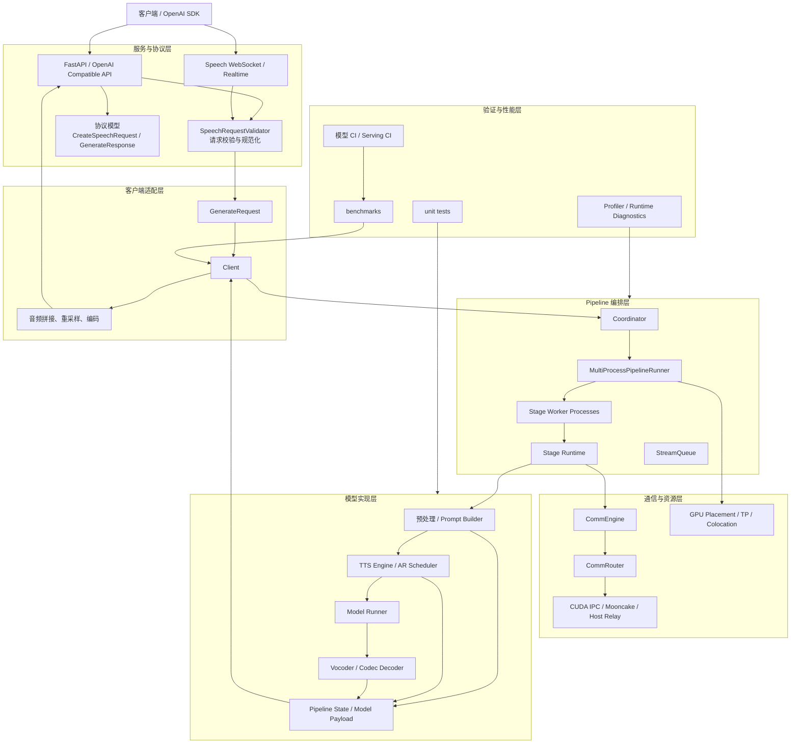
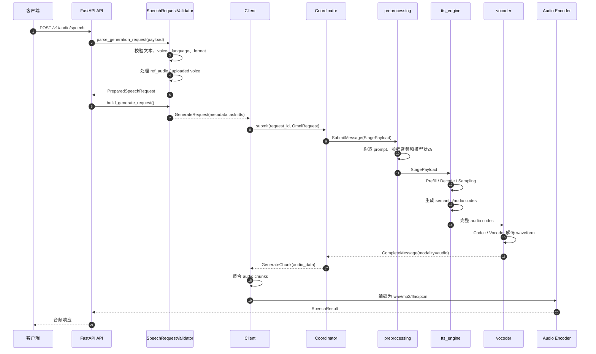
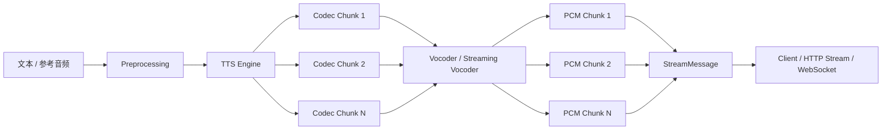
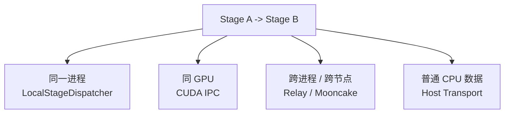
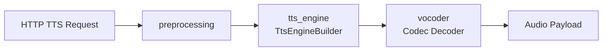
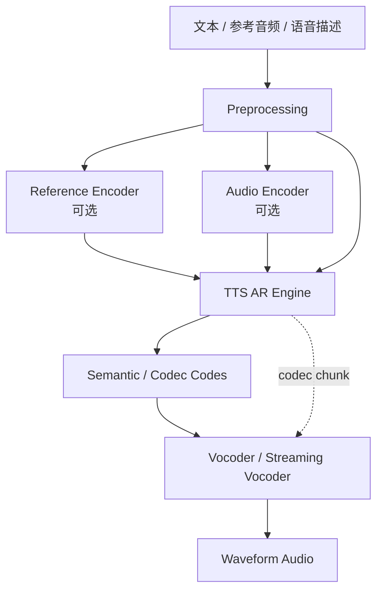
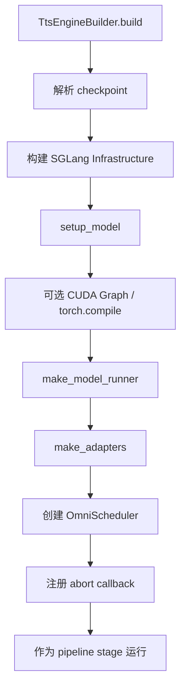
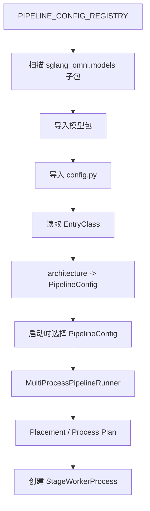
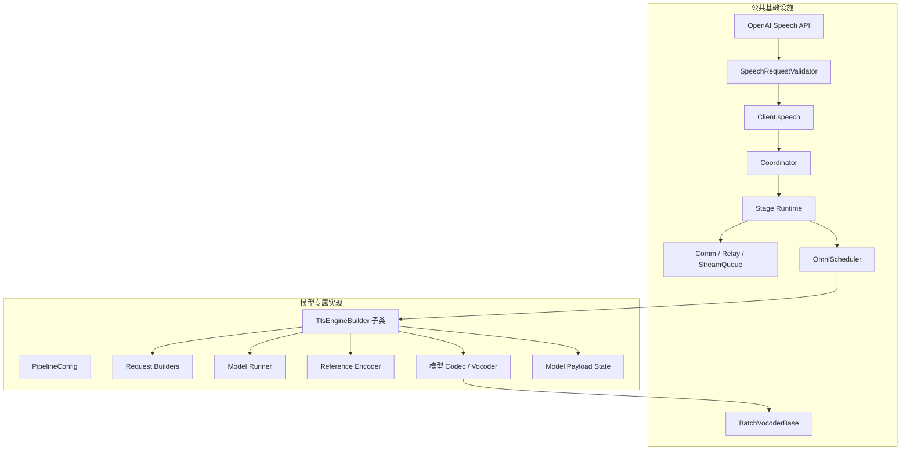

# SGLang-Omni TTS 架构与接入分析

本文基于当前源码整理 SGLang-Omni 的模块划分、TTS 请求执行逻辑和新 TTS 后端的接入边界。

当前项目已经包含多个 TTS 后端，包括 Qwen3-TTS、Zonos2、Higgs TTS、MOSS-TTS、FishAudio S2 Pro、Ming-TTS 和 Voxtral TTS。因此，后续接入新的 TTS 模型，主要工作是实现模型专属的 pipeline 配置、请求映射、推理 runner 和 vocoder，而不是重新搭建服务框架。

## 1. 总体模块划分



### 1.1 主要目录职责

| 目录 | 职责 |
| --- | --- |
| `sglang_omni/serve` | FastAPI、OpenAI 兼容 API、TTS 校验、语音上传和 WebSocket |
| `sglang_omni/client` | 将 API 请求转换为内部请求，聚合输出并编码音频 |
| `sglang_omni/pipeline` | Coordinator、Stage、进程编排、阶段路由和流式传输 |
| `sglang_omni/config` | Pipeline 拓扑、资源、并行度和通信配置 |
| `sglang_omni/scheduling` | 批处理、KV cache、SGLang engine、vocoder scheduler |
| `sglang_omni/models` | 各模型的配置、预处理、模型 runner、状态和音频解码 |
| `sglang_omni/comm`、`sglang_omni/relay` | 阶段之间的数据传输和 GPU/跨进程通信 |
| `sglang_omni/proto` | `OmniRequest`、`StagePayload`、完成消息和流式消息 |
| `tests`、`benchmarks` | 单元测试、模型 CI、服务测试和性能评测 |

## 2. 非流式 TTS 执行逻辑

公共 API 位于 `sglang_omni/serve/openai_api.py`，请求规范化主要由 `SpeechRequestValidator` 完成，内部请求由 `Client` 发送到 `Coordinator`。



对应的内部数据结构为：

```text
OmniRequest
├── inputs
├── params
└── metadata

StagePayload
├── request_id
├── request: OmniRequest
└── data
```

TTS 请求通常使用：

- `metadata["task"] = "tts"` 标识任务类型。
- `metadata["tts_params"]` 保存语言、voice、reference 和模型专属参数。
- `StagePayload.data` 保存阶段之间传递的中间状态。
- 模型专属状态通过 pipeline state 机制写入和恢复。

## 3. 流式 TTS 执行逻辑

支持流式的模型会让 engine 逐步生成 codec chunk，并通过 `StageConfig.stream_to` 将 chunk 发送给 vocoder。vocoder 再产生 PCM chunk，最终由 HTTP 或 WebSocket 层输出。



流式链路涉及：

- `StageConfig.stream_to`：声明流式数据的目标阶段。
- `StreamQueue`：维护请求级别的有序 chunk 队列。
- `StreamMessage`：跨阶段和 Coordinator 传递流式结果。
- `select_audio_delta`：避免重复发送已经输出的 waveform 样本。
- `encode_pcm`：将音频 chunk 转换为 PCM 字节。

阶段通信根据部署位置选择不同的数据面：



## 4. Pipeline 阶段抽象

`PipelineConfig` 和 `StageConfig` 共同构成声明式 pipeline。每个阶段通过 factory 动态创建，配置同时描述计算拓扑、资源布局和通信方式。



常见模型拓扑如下：



典型后端可以归纳为：

| 类型 | 模型示例 | 特点 |
| --- | --- | --- |
| 基础三阶段 | Qwen3-TTS | preprocessing → engine → vocoder |
| 带参考音频编码 | Zonos2、Audar TTS | 增加 speaker/reference encoder |
| 流式 codec 解码 | FishAudio S2 Pro、MOSS-TTS、Higgs TTS | engine 通过 stream edge 推送 chunk |
| Omni 联合模型 | Qwen3-Omni、Ming-Omni | thinker、talker、segmenter、code2wav 协作 |
| 特殊自包含后端 | Voxtral TTS | 使用模型专属生成和音频解码逻辑 |

## 5. TTS Engine 通用构建模板

基于 SGLang 自回归生成的 TTS 后端可以继承 `sglang_omni/scheduling/engine_factory.py` 中的 `TtsEngineBuilder`。



一个新模型通常需要实现：

```text
my_tts/
├── __init__.py
├── config.py              # 必须提供 EntryClass
├── stages.py
├── request_builders.py
├── payload_types.py
├── engine_builder.py      # 可复用 TtsEngineBuilder
├── model_runner.py        # 自定义 AR 行为时需要
└── vocoder.py             # 非标准 vocoder 时需要
```

`TtsEngineBuilder` 的关键扩展点：

- `generation_defaults`：默认 batch、context、CUDA Graph 和 compile 配置。
- `setup_model`：加载模型、processor、speech tokenizer 和参考音频组件。
- `make_model_runner`：构造模型执行器。
- `make_adapters`：提供 request builder 和 result adapter。
- `make_abort_callback`：释放预处理上下文、缓存和中间状态。
- `make_scheduler`：默认使用 `OmniScheduler`，必要时可自定义。

## 6. 模型注册与启动

模型配置由 `sglang_omni/models/registry.py` 动态扫描。模型包的 `config.py` 必须暴露 `EntryClass`。



启动过程的关键步骤：

1. 读取并校验 `PipelineConfig`。
2. 根据 `gpu`、`tp_size`、`process` 和资源预算生成 placement/process plan。
3. 为每个 stage 分配 endpoint 和通信配置。
4. 在 worker 进程中通过 dotted factory path 创建 stage executor。
5. 启动 `Coordinator`、各个 stage 和模型 scheduler。
6. 创建 FastAPI 应用，并把 pipeline 的 speech capability 传给 `SpeechRequestValidator`。

## 7. 公共抽象与模型专属实现

推荐保持如下职责边界：



应尽量复用的部分：

- OpenAI TTS API、批量 API、语音上传和 WebSocket 生命周期。
- `SpeechRequestValidator` 的基础校验和资源安全策略。
- `Client.speech` 的请求发送、音频聚合和格式编码。
- `Coordinator`、`Stage`、`StreamQueue` 和 relay 通信。
- `TtsEngineBuilder`、`OmniScheduler` 和 `BatchVocoderBase`。

模型自行负责的部分：

- 文本规范化、prompt 构造和特殊 token。
- 参考音频编码、speaker embedding 或 voice conditioning。
- semantic token、codec token 和 subtalker 的生成逻辑。
- codec 到 waveform 的解码算法。
- 模型特有的采样、缓存和 abort 清理。

## 8. 新 TTS 后端接入步骤

建议按以下顺序实现：

1. 确认模型输入输出：文本、语言、speaker、参考音频、instruction 和返回采样率。
2. 定义模型自己的 `PayloadState`，明确阶段间传递的最小状态。
3. 实现 `request_builders.py`，完成公共 TTS 参数到模型输入的映射。
4. 创建 `config.py`，声明 `architecture`、stage topology、GPU、TP 和 stream edge，并提供 `EntryClass`。
5. 如果模型是自回归 codec 模型，优先继承 `TtsEngineBuilder`。
6. 实现 model runner，明确 prefill、decode、sampling 和 codec frame 收集逻辑。
7. 实现 vocoder；如果支持增量解码，在配置中增加 `stream_to=["vocoder"]`。
8. 在模型包 `__init__.py` 中声明 `ModelCapabilities`。
9. 增加配置契约、request builder、state lifecycle、vocoder 和 serving smoke tests。
10. 增加 benchmark，测量 TTFT、首个音频 chunk、RTF、吞吐和显存占用。

## 9. 关键风险点

### 9.1 Codec 与 waveform 的边界

engine 输出的 codec chunk 不等于最终 waveform。必须明确：

- chunk 是否可以独立解码。
- vocoder 是否需要上下文窗口或 overlap。
- 最后一个 chunk 是否需要 flush。
- 是否会重复输出已经解码的样本。
- sample rate 是否固定，是否需要重采样。

### 9.2 完整 payload 与 stream chunk 的一致性

同一请求可能同时存在完整状态和流式状态。模型实现需要保证：

- `StagePayload.data` 可在阶段间序列化。
- stream chunk 不依赖接收方尚未构造的进程内对象。
- abort 后清理准备请求、参考音频缓存和 vocoder session。
- stream 结束信号和最终 payload 的顺序可控。

### 9.3 GPU 与进程布局

TTS engine 和 vocoder 可能有完全不同的显存与吞吐特征。应根据实际模型决定：

- 是否同 GPU 共置。
- vocoder 是否独立进程。
- 是否使用 TP。
- 是否允许 engine 和 vocoder 通过 CUDA IPC 传输。
- 是否需要为 vocoder 单独预留显存比例。

### 9.4 API capability 与 checkpoint policy

架构能力不一定等于 checkpoint 能力。例如某个架构支持参考音频，但具体 CustomVoice checkpoint 可能拒绝上传参考音频。因此应区分：

- `ModelCapabilities`：架构级能力。
- `PipelineConfig` 方法：当前 checkpoint 和部署策略。
- `SpeechRequestValidator`：请求级校验和错误返回。

## 10. 验证矩阵

建议至少覆盖以下测试层次：

| 层次 | 验证内容 |
| --- | --- |
| 配置契约 | `EntryClass`、architecture、stage factory、terminal stage、stream edge |
| Request builder | 文本、语言、voice、reference、sampling、seed 映射 |
| State lifecycle | payload 序列化、恢复、完成和 abort 清理 |
| Model runner | prefill/decode、采样、codec frame 收集 |
| Vocoder | 单条、批量、首 chunk、最后 flush、采样率 |
| Pipeline topology | 同进程、跨进程、跨 GPU、TP 和 stream route |
| Serving | `/v1/audio/speech`、batch、PCM stream、WebSocket |
| 性能 | TTFT、首音频延迟、RTF、吞吐、显存和长文本稳定性 |

现有相关测试包括：

- `tests/unit_test/qwen3_tts/test_pipeline.py`
- `tests/unit_test/moss_tts/test_pipeline.py`
- `tests/unit_test/fishaudio_s2_pro/test_streaming_vocoder.py`
- `tests/unit_test/pipeline/test_topology.py`
- `tests/test_model/test_tts_serving_ci.py`

## 11. 结论

SGLang-Omni 的 TTS 接入模型可以概括为：

```text
公共 TTS 服务协议
    + 声明式 Pipeline 拓扑
    + 通用 Coordinator / Stage / Transport
    + 通用 SGLang TTS Engine Builder
    + 模型专属 Request Builder / Runner / Vocoder
```

接入新模型时，最需要守住的是三个契约：

1. 公共 speech request 到内部 `GenerateRequest` 的参数映射。
2. TTS engine 输出的 codec/state 与 vocoder 输入之间的 payload 契约。
3. 完整音频、流式 chunk、abort 和最终完成消息之间的生命周期契约。
