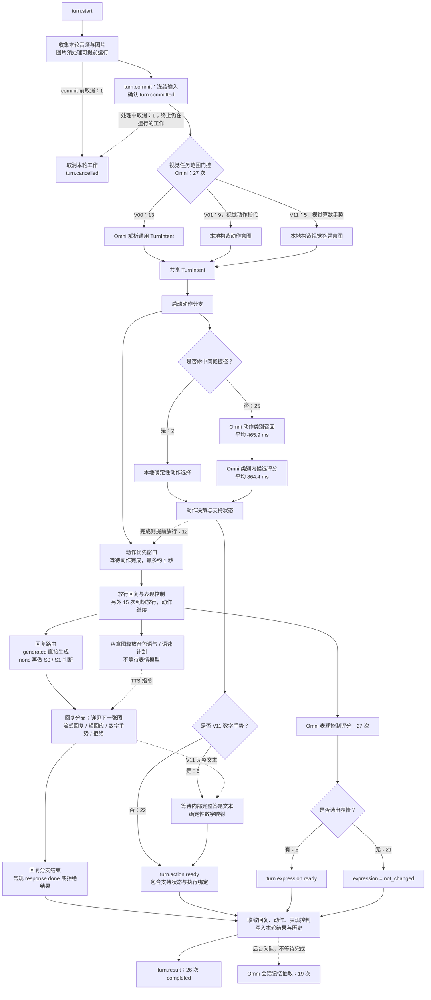
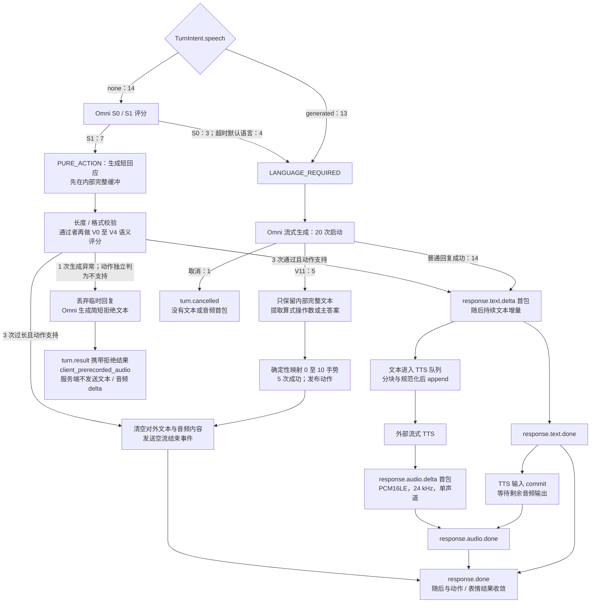
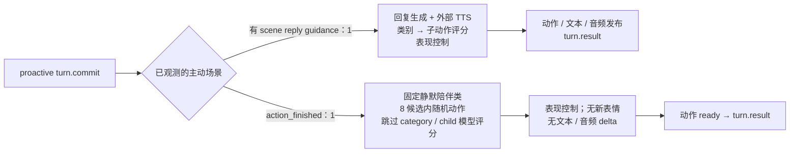

# SGLang-Omni：当前 Turn 全链路与耗时实测

> 观察窗口：**2026-09-16 23:23:04 ≤ 日志时间 < 2026-09-17 00:23:04，Asia/Shanghai（UTC+8）**。这是收到“近一个小时”要求时固定的窗口，不随分析过程向后滑动。
>
> 本文用日志确认“实际经过哪些节点”，用当前源码解释节点输入、输出与缓存边界。截图仅作为展示粒度参考，不作为系统实现依据。流程图只展示窗口内实际出现的路径；预热和旧进程的主动 Turn 单列，不混入当前用户 Turn 的耗时统计。

## 1. 先建立整体认识

当前服务不是“一次调用 Omni，同时得到文字、声音、动作和表情”。它是**多个共享当前 Turn 输入的 Omni 请求，由服务端编排，再接外部流式 TTS**：

- 先解析当前任务，再给动作分支一个最多约 **1 秒**的优先窗口；动作完成或窗口到期，才放行回复路由、回复生成和表情选择。到期只放行其他工作，**不会取消动作**。
- 动作采用“类别评分 → 类别内候选评分”，其中 2 个问候 Turn 走确定性捷径，跳过这两次模型评分。
- 文本由 Omni 生成；声音由**外部 TTS**根据文本生成。本窗口不是 Omni Talker / Code2Wav 直接输出语音。
- 动作、表情、文本、音频各有自己的可发布时间，不必一起返回。`turn.result` 才是服务端本轮的最终收敛结果。
- 5 个“看图算数、用手势作答”的 Turn 内部生成了完整文本，再**确定性映射数字手势**；对外没有文本或音频首包，也没有实际调用数字手势二阶段评分模型。
- 普通回复实际带有角色指令和 `provided_context` 知识证据。**当前输入优先 / CURRENT_ONLY 不等于只有音频和图片，也不等于没有知识上下文。**

### 1.1 样本范围

| 范围 | Session / 进程 | 实际数量 | 本文处理方式 |
|---|---|---:|---|
| 当前进程的用户 Turn | `sess_8028f71c`、`sess_ee2fb602`；API PID `836151` | 27 次 commit：26 completed，1 cancelled | 主流程和主统计 |
| 当前进程、commit 前取消 | `sess_466b31cb` / `turn_6886a96f_1` | 1 次 start，无 commit | 画出取消路径，不计 commit 后统计 |
| 窗口前段旧进程的主动 Turn | `sess_d75788c9`；API PID `3803188` | 2 次 commit，均 completed | 第 9 节单列 |
| 仅建立 Session | `sess_ca8aff6a`、`sess_4f779a6a` | 无 commit | 仅计入预热观察 |
| 全局 / Session / standby 预热、资源采样 | 包括 `standby-warm` | 非业务 Turn | 不混入用户 Turn 延迟 |

窗口内共 30 次 turn start、29 次 commit、28 次 completed、2 次 cancelled。主样本来自两个有用户提交的 Session，数量较小，**不是容量压测或 SLA 结论**。没有仅凭 Session 名称推断请求一定来自真人；本文区分的是日志中的用户来源、主动来源和预热请求。

当前进程日志显示：`qwen3-omni-single-gpu`，请求模态为 `text / audio / expression / action`，动作选择为 hierarchical，动作目录有 51 类、524 个候选，`action_ready_tts_decoupled=true`。23:28:51 模型管线 ready，23:29:04 API ready，因此不能把窗口前后当作同一个进程连续采样。

阅读建议：首次了解系统先看第 2–4 节；排查延迟看第 6–7 节；讨论缓存看第 5 节；单轮追溯看第 10–11 节。流程图使用 Mermaid，需在支持 Mermaid 的 Markdown 预览器或仓库文档站中打开。

## 2. 总流程图：从 Turn 开始到各路输出

实线表示执行或数据依赖，虚线表示放行条件 / 后台工作。分支数字是本窗口当前进程的样本数，不代表彼此都互斥；例如同一 Turn 会同时经过动作和表情分支。



理解这张图时注意：

1. “动作优先”不等于“等动作后才做所有工作”：前面的门控、意图解析已经完成；它限制的是后续回复 / 表现控制竞争。
2. 普通动作可独立发布，不必等文本或 TTS。表情也可以早于或晚于动作发布。
3. 发布动作是**发送动作决策**，不是数字人已经执行完该动作；发布表情也不是前端已显示出来。
4. 单 GPU 上的协程并行不等于 GPU 无等待；后面会看到 admission 等待、调度等待和前缀计算。

## 3. 回复分支：哪些路径真的产生首包？



这里的 `speech=none` 只是初始意图，不保证最终静音：14 次中，7 次经 S0/S1 或超时回退进入普通语言回复。另外 7 次纯动作也允许经过校验的短社交回应，其中 3 次实际说话。

`PURE_ACTION` 的拒绝不是因为短回应生成异常而“判动作不支持”。**动作支持性来自独立动作分支**；本窗口唯一不支持案例恰好也发生了短回应生成异常。

## 4. 各节点的输入、输出与模型请求组成

### 4.1 输入不是同一份“大 Prompt”到处转发

本窗口 27 个用户 Turn 的 commit 都没有 `turn.text`，都有音频及图片。音频 chunk 数为 39–263；收到图片 5–9 帧，包含用户摄像头 `user_camera` 和角色画面 `avatar_state`。服务端把本轮音频冻结为完整音频输入，图片按时间 / 序号整理，随后**各分支自行选择自己的输入**。

角色画面是角色自身的视觉信息，用户摄像头是用户及其环境；二者不能互相替代。回复分支过滤角色画面，动作分支可使用角色画面与用户摄像头，门控与语音路由本次都不向模型送图片。

| 节点 | 输入由什么构成 | 输出与消费者 |
|---|---|---|
| 输入收集 / commit | 本轮音频 chunks、带 role 的图像、输出 modalities、候选允许 / 排除约束、已执行动作与姿态等 commit 状态 | 冻结的音频、预处理图片、`TurnBuffer`；确认 `turn.committed` |
| 视觉范围门控 | 固定门控 system + 当前音频；有当前文本时可附带，但本窗口没有。**不送图片**；有摄像头输入是启用条件之一 | `V00 / V01 / V11`，决定如何取得意图；不是这一步就看图识别出答案 |
| 通用 TurnIntent | 仅 V00：固定意图解析 system + 当前音频；不含角色大 Prompt、知识块、历史或图片 | 结构化 speech、body_mode、body、face、history、reaction、可选 voice tone / pace 等；供动作、回复、表现控制使用 |
| V01 / V11 意图构造 | 门控 ID + 固定业务规则，不再调用通用 JSON 意图模型 | V01 构造视觉动作指代任务；V11 构造视觉答题任务，留待回复模型真正读图 |
| 问候捷径 | 意图、允许动作及动作目录 | 确定性动作决策；本窗口 2 次，不做类别 / 子候选评分 |
| 动作类别评分 | 固定类别说明；独立 Session 动作指令；意图中的动作文本；当前音频；经裁剪与过滤的当前图片；姿态及候选约束 | 类别或类别集合、分数及上下文；进入 child。25 次，候选宽度实际为 6 / 8 / 11 / 51 |
| 类别内候选评分 | 选定类别 / 合并类别的候选定义；Session 动作指令；当前音频与动作图片；意图、姿态及约束 | 具体 action、candidate、执行绑定、supported / unsupported、fallback。25 次，候选 2–149 个 |
| 动作优先窗口 | 已启动的动作任务与约 1 秒 deadline | 完成或到期事件，放行回复路由 / 生成 / 表现控制；不增加模型调用 |
| S0 / S1 语音需求消歧 | 固定分类规则 + 当前音频；无图片、历史和角色大 Prompt；只在初始 `speech=none` 时调用 | LANGUAGE_REQUIRED 或 PURE_ACTION；4 次超时回退到 LANGUAGE_REQUIRED |
| 表现控制 / 表情 | 固定表情目录与 scope 规则 + 当前音频 + 意图的 action_context；本次无图片、无历史 | expression 候选或 none；本次 6 次发布表情、21 次不改变表情 |
| 语气 / 语速计划 | TurnIntent 的 voice tone / pace，通过 future 立即释放 | TTS instruction；不是等待表情模型后才让 TTS 开始 |
| 普通 / V11 回复 | 角色 system、服务器回复规则、当前摄像头图片、知识证据、意图、当前音频、姿态上下文、语言 / 视觉限制；具体顺序见下文 | 流式文本；普通路径对外发送，V11 内部使用完整文本 |
| 纯动作短回应 | 同一回复构造器，但不传图片、历史；保留角色指令、知识证据、意图、音频和短回应规则 | 完整缓冲短句，长度 / 格式校验；仅安全内容才交给发送与 TTS |
| 短回应语义校验 | 固定违规类型说明 + 当前音频 + 待校验短句；无图片 / 历史 | 对 V0–V4 候选评分；本次 3 次均接受 |
| 不支持动作的拒绝回复 | 角色指令 + 专用拒绝规则；最新角色画面（有则使用）、settled 姿态记录、当前音频 / 文本；不带用户摄像头 | 1 次生成简短拒绝文本，最终结果标记 `client_prerecorded_audio`；本服务不合成该次拒绝音频 |
| 数字手势映射 | V11 的完整生成文本 + 数字动作候选 | 本次 5 次提取操作数求和或主答案后直接映射，结果为 3 / 5；模型二次评分未发生 |
| 外部 TTS | 已允许发布的文本、voice / 语气 / 语速指令、会话级 TTS 连接 | 流式 PCM chunks、首包和结束事件；不是 Omni 音频解码 |
| 最终收敛 | 回复最终文本 / 状态、动作支持性 / 执行绑定、表情结果、各分支错误 / 取消信息 | `turn.result`、历史 / 动作状态更新；安排后台记忆 |
| 后台记忆抽取 | 固定抽取规则 + active claims / open threads / store revision + 待处理 Turn 的音频、用户文本和序号；不送图片，也不是把助手回复原样重放 | claims、episodes、threads 等结构化更新；19 次，不阻塞本次 result |

动作 Session 指令不是普通回复 system 的直接复制。它由角色 persona、视觉行为偏好、被动动作策略、类别 / 动作偏好、运行时动作规则、当前实体信息等组成，具体拼接取决于已配置字段。当前用户图片策略也会进入相应动作指令。动作图片保留最新角色帧，并限制当前图片数量（源码上限 8）；是否继续保留用户图像取决于视觉模仿 / 反应场景，不是每个节点都消费 commit 的全部图片。

本次 `has_body=true` 为 11 / 27，`has_face=true` 为 0 / 27；表现控制 scope 为 `body_only` 11 次、`none` 16 次。没有明确 face 指令不代表不允许伴随表情，因此仍有 6 次表情输出。

### 4.2 普通回复模型实际收到的内容顺序

20 次普通 / V11 生成请求的 `reply_logical_input` 都是 **2 条 messages：system + user**，`reply_history_route_decision=CURRENT_ONLY`、forwarded history 为 0。角色原始指令在诊断日志中做了脱敏，不能拿脱敏占位字符串长度当作实际 Prompt 长度。

```text
system
└─ Session 角色指令 + 服务端角色 / 回复行为约束
   实测总长度：25,816 字符

user（按模型实际接收顺序）
├─ 摄像头角色说明：270 字符
├─ 本轮 user_camera 图片：4–8 帧；不传 avatar_state
├─ provided_context 知识证据：20,284 字符
├─ 当前用户任务优先级规则：562 字符
├─ TurnIntent 解析后的任务 JSON：长度随本轮变化
├─ 当前完整音频：1 个音频占位，媒体通过 metadata 传入
├─ reply_context：本次是 settled 角色姿态记录，210 字符
├─ 用户摄像头与角色主体区分规则：861 字符
├─ 固定回复语言规则：395 字符
└─ 仅 V11：视觉算式操作数输出规则，996 字符
```

这 20 次请求的模型侧总输入为 **11,592–12,189 tokens，平均 11,818 tokens**，含媒体展开后的 token；字符数与 token 数不是一回事。采样日志为 temperature=0.4、top_p=1.0、max_new_tokens=512，输出模态仅 `text`。

本次知识是 Session 已提供的 `provided_context`，在本地拼入请求；没有观察到每轮在线知识检索 RPC。**“没有检索等待”不代表“没有知识输入”。** 纯动作短回应复用该构造器但去掉图片，并把生成上限设为 48 tokens；拒绝路径使用独立、较短的输入构造器。

### 4.3 模型调用方式与次数

| 请求种类 | 当前用户样本内次数 | 调用方式 | 是否直接生成面向用户的文本 |
|---|---:|---|---|
| 视觉范围门控 | 27 | Omni 短生成，最多 8 tokens | 否，只输出路由 ID |
| 通用 TurnIntent | 13 | Omni JSON 生成，最多 256 tokens | 否 |
| 动作类别 / 子候选 | 25 / 25 | 同一前缀下的候选后缀评分 | 否 |
| S0 / S1 | 14 次尝试：10 成功、4 超时 | 两候选后缀评分 | 否 |
| 表现控制 | 27 | 每次 12 个短 ID 候选评分 | 否 |
| 普通 / V11 回复 | 20 次启动：19 次有内部首文本、1 取消 | Omni 流式文本生成 | 普通路径会；V11 不会 |
| 纯动作短回应 | 7 次尝试 | Omni 生成后缓冲校验 | 仅 3 次最终发布 |
| 短回应语义校验 | 3 | 5 候选后缀评分 | 否 |
| 拒绝回复 | 1 | Omni 文本生成，最多 96 tokens | 文本放入最终拒绝结果，不走文本 delta |
| 数字手势二阶段模型评分 | **0** | 本次均由确定性映射代替 | 不适用 |
| 后台记忆抽取 | 19 | Omni 结构化生成，background 优先级 | 否 |

候选评分不是“把每个候选的完整多模态 Prompt 从头算一遍”，而是先得到共享父前缀 KV，再计算各候选后缀的 log probability。动作 category / child 的 admission priority 为 0，performance 为 1，S0/S1 和短回应校验为 2；它们仍会与其他请求竞争同一 GPU。

## 5. 哪些能复用 KV cache？实际复用了多少？

### 5.1 先区分三种缓存

| 缓存 | 保存什么 | 本窗口的证据 | 不应误解为 |
|---|---|---|---|
| 媒体 / 预处理上下文缓存 | 已处理媒体、预处理上下文 | category 25 次 context miss；对应 child 25 次 context hit | 模型所有 token 都免算 |
| 音频 / 图像编码器缓存 | 多模态 encoder 的计算结果 | category / child / performance 音频编码均记录 hit；category 图像计算后，child 图像记录 hit | LLM 的 KV 命中 |
| Thinker 前缀 KV | 一段精确前缀的注意力状态 | 见下面 parent cached / computed token | 只要意思相同或图片相同就能复用 |

KV 复用要求从开头到命中位置的 token、媒体身份、位置与缓存 scope 相容。**相同后缀不能跳过变化的前文单独复用**；相同音频出现在不同任务 Prompt 中，也不意味着这些模型请求可共用整段 KV。

### 5.2 动作评分的三层边界

```text
动作评分父前缀
┌────────────────────┬────────────────────────┬──────────────────────────┐
│ 已发布且验证通过的目录 │ Session 动作指令等稳定段 │ 当前意图 / 状态 / 媒体等动态段 │
│ public scope        │ session scope          │ request-private scope    │
│ 可跨 Session 共享     │ 只在同一 Session 内共享   │ 只供本请求及其候选共享       │
└────────────────────┴────────────────────────┴──────────────────────────┘
                                                          ↓
                                           同一父前缀 → 多个候选后缀
```

public 不是任意自称“静态”的文本：服务端只接受已发布的全局 category / child Prompt，并验证实际 token 前缀。合并类别、视觉专用 child Prompt 不一定属于已发布 public Prompt；它们仍可能在同一 Session 内复用。Session namespace 带有 session instance、stage、origin 和指令 hash，指令变化会使旧前缀不能直接复用。

| 阶段 | n | 平均父前缀 tokens | 平均已命中 tokens | 平均本次计算 tokens | 平均逐请求命中率 |
|---|---:|---:|---:|---:|---:|
| category | 25 | 13,411.6 | 11,478.8 | 1,932.8 | 85.5% |
| child | 25 | 10,683.2 | 6,400.3 | 4,282.9 | 56.6% |
| performance | 27 | 801.0 | 0 | 801.0 | 0% |

这些比例是 `parent_cache_hit_ratio` 的逐请求算术平均，不是把两列平均值相除。category 的已验证 public 段均为 6,259 tokens；Session 可复用边界平均约 12,128 tokens。child 的边界随目录与组合变化，不能假定每轮都是全热。

**`prefix_cached=true` 不等于父前缀跨 Turn 命中。** 三个阶段都记录为 true，但它确认的是候选请求完整复用了本次父前缀；三阶段共 77 个请求的 `candidate_prefix_recompute_tokens` 均为 0。performance 的父前缀实际仍是 0 命中、每轮约 801 tokens 需要计算。

performance 为什么没有命中：当前实现虽声明 `cache_static_system_only`，但它的专用 Prompt 不是已发布的 public 动作目录；请求又含音频，且没有 category / child 那种独立验证的 Session instruction 边界，最终跨请求共享边界被限制。这个结论来自 scope 代码与实际计数共同验证，不应仅凭 namespace 名称判断“已经缓存”。S0/S1、短回应校验也应按同一边界规则审视，本文没有为它们虚构单独的实测命中率。

### 5.3 普通生成请求的可复用部分

| 请求 / 内容 | 逻辑上可复用的部分 | 本窗口不能据此声称什么 |
|---|---|---|
| 门控、JSON 意图解析 | 同一 Session、同一任务下完全一致的前置 system，直到当前动态输入开始 | 不代表门控和意图可共享完整前缀；二者 system 不同 |
| 普通回复 | 同一 Session 的稳定角色 system 和后续连续相同前缀 | 日志未在此处给出可与 action stats 同口径的逐请求 KV 命中率 |
| 20,284 字符知识证据 | 只有它**之前的全部前缀也一致**，才能随前缀一起命中 | 本次排列是“当前摄像头图片 → 知识块”；变化的图片会打断前缀，不能因为知识块相同就把它算成每轮已缓存 |
| 当前音频 / 图片及后面的文本 | 可受媒体 encoder 缓存帮助；同一请求内部可复用 | 跨 Turn 的整段 Thinker KV 不因此自动可复用 |
| 纯动作短回应 / 拒绝 / 记忆抽取 | 各自同一 Session 下精确一致的前缀，仍受任务 Prompt 和动态内容位置影响 | 不能把普通回复的命中率套给它们 |

普通生成请求使用 Session owner 隔离的私有 cache key，不把用户角色、知识或媒体当作跨 Session 公共前缀。本文说明的是**当前可复用边界与观察值**，没有修改 Prompt 排序、缓存策略或服务配置。

## 6. 节点耗时与用户可见里程碑

### 6.1 统计口径

- 单位均为 **毫秒**；除特别注明外，主样本为当前进程的 27 个 committed user Turn。
- 累计耗时以服务端 `turn_commit_received` 为 T0，使用同机 `monotonic_ns` 做差；不是用户开始说话、VAD 停止或前端发包时刻。
- 首包以 `ws_event_sent.ws_event_type` 的**实际协议事件**为准；不使用仅代表内部缓冲的“first delta”标记冒充已对外发送。
- n 是该指标实际存在的样本数。没有首包的静音 / 取消 / 拒绝路径记为“—”，不当作 0 混入平均。
- P90 使用排序后的线性插值。不同分支的 n 不同，不能把均值或 P90 直接相加还原总耗时。

### 6.2 节点自身 / 相邻节点耗时

| 节点或区间 | n | 平均 ms | P90 ms | 如何理解 |
|---|---:|---:|---:|---|
| turn.start 接收 → commit 接收 | 27 | 4,105.2 | 8,527.4 | 包括用户输入 / 采集时间，不是推理延迟 |
| commit 后等图片预处理 | 27 | 0.032 | 0.036 | 多数工作已提前完成；不是图像 encoder 总耗时 |
| 视觉范围门控 | 27 | 89.6 | 100.9 | 一次短模型调用 |
| TurnIntent 总阶段 | 27 | 225.8 | 376.4 | **已包含门控**；不能再加上一行。V00 平均 372.2，V01 85.2，V11 97.8 |
| V00 门控完成 → 通用意图 ready | 13 | 282.8 | 362.9 | JSON 意图调用及其邻接本地处理；是上一行阶段的子区间 |
| 动作优先窗口等待 | 27 | 853.5 | 1,001.3 | 有意的放行等待，通常与动作工作重叠 |
| 动作 category 评分 | 25 | 465.9 | 664.8 | 不含 2 次问候捷径；含排队、预处理、推理等 |
| 动作 child 评分 | 25 | 864.4 | 1,655.7 | 可有多个 suffix batch；含等待，不是纯 GPU kernel 时间 |
| S0 / S1 正常完成 | 10 | 308.6 | 373.9 | 7 次纯动作、3 次语言 |
| S0 / S1 超时回退 | 4 | 501.3 | 501.8 | 约 500 ms 截止后走语言路径 |
| performance 评分 | 27 | 567.4 | 1,658.2 | 表现控制模型请求，可能与其他请求竞争 |
| 普通回复 request 构造 | 20 | 0.375 | 0.404 | 本地组装，非模型 prefill |
| 普通回复提交 → 内部首文本 | 19 | 918.3 | 1,164.0 | 含 V11 的内部文本；1 次取消不计首文本 |
| 纯动作短回应分支 `generation_ms` | 7 | 329.6 | 601.6 | **包括校验与后续 provided-text / TTS 路径**，不能称为纯生成耗时 |
| 短回应语义校验 | 3 | 100.2 | 101.1 | 5 候选评分，均接受 |
| 拒绝回复生成 | 1 | 1,284.8 | 1,284.8 | 单样本，不用于泛化 |
| V11 数字分支等待完整回复 | 5 | 686.7 | 726.5 | 从进入等待到取得完整文本，不是第二次模型评分 |
| TTS 首文本入队 → 首 append | 17 | 40.1 | 60.5 | 文本分块 / 缓冲及本地处理 |
| TTS 首 append → 收到首 PCM | 17 | 193.4 | 206.1 | 包含外部 TTS 链路，不是纯合成 kernel 时间 |
| TTS 首文本入队 → 收到首 PCM | 17 | 233.5 | 262.6 | 上两区间的整体 |
| 表情决定 → 表情发布 | 6 | 0.181 | 0.212 | 本地发布开销 |
| response.done → turn.result | 25 | 0.464 | 0.535 | 这批有 response.done 的样本里最终收尾很短 |
| 后台记忆抽取 | 19 | 313.6 | 374.6 | 不阻塞当前 result；入队等待平均另约 0.7 ms |

图片预处理 worker 时间每轮合计平均 6.1 ms，主要与输入收集重叠；不要把它与 commit 等待 0.032 ms 当成同一个量。V11 的确定性数字决策日志 `elapsed_ms=0.0` 表示没有模型评分，并非提取、映射和发布绝对零开销；等待完整文本另计。

音频冻结、确定性意图构造、候选本地过滤、知识块拼接、voice future 释放等本地小步骤没有独立且完整的计时埋点，包含在相邻阶段墙钟内；本文不把“未单独测量”写成 0 ms。

### 6.3 从 commit 到实际输出

| 实际里程碑 | n | 平均 ms | P90 ms | 边界 |
|---|---:|---:|---:|---|
| TurnIntent ready | 27 | 226.4 | 377.0 | 服务内部语义结果 |
| 动作优先窗口放行 | 27 | 1,080.0 | 1,365.2 | 后续回复 / 表情可开始 |
| `turn.action.ready` | 27 | 1,625.3 | 2,685.7 | 服务端发出动作决策 |
| `turn.expression.ready` | 6 | 1,284.6 | 1,897.9 | 只统计实际有表情的 6 个 Turn |
| `response.text.delta` 首包 | 17 | 2,160.2 | 2,876.1 | 实际发出非空文本流 |
| `response.audio.delta` 首包 | 17 | 2,393.6 | 3,111.2 | 实际发出首段 PCM |
| `response.text.done` | 25 | 2,125.7 | 3,138.7 | 包含空文本流，因此均值可低于首文本均值 |
| `response.audio.done` | 25 | 2,860.8 | 4,068.3 | 包含无音频 chunk 的结束事件 |
| `response.done` | 25 | 2,860.9 | 4,068.4 | 回复流结束，不等于前端播放完 |
| `turn.result` | 26 | 2,855.2 | 4,057.6 | 包含没有 response.done 的拒绝案例 |

这些平均值不能拼成一条“平均 Turn”：例如 expression 只有 6 个样本、text 有 17 个，result 有 26 个。首包指标也不包含网络到客户端、播放器缓冲、数字人渲染或动作执行完成的时间。

### 6.4 动作 / 表情请求内部耗时拆解

以下为每阶段的均值，单位 ms。**这些列存在包含关系，不可横向求和。**

| 统计字段 | category（25） | child（25） | performance（27） |
|---|---:|---:|---:|
| 整个 score 请求 elapsed | 465.9 | 864.4 | 567.4 |
| admission 动作槽等待 | 0.027 | 0.023 | 150.8 |
| preprocessing | 70.9 | 58.3 | 7.4 |
| audio encoder | 0.234 | 0.214 | 0.155 |
| image encoder | 31.8 | 0.193 | 不适用 |
| scheduler 累计等待 | 8.0 | 133.4 | 192.5 |
| prefix prefill 墙钟时间 | 279.1 | 438.6 | 103.4 |
| suffix batch 总墙钟时间 | 53.0 | 250.3 | 220.5 |
| 其中 suffix batch 排队 | 5.9 | 131.4 | 150.0 |

`scheduler_wait_ms` 已包含 suffix 排队；`suffix_batch_ms` 本身也包含该 batch 的排队。prefix prefill 从前缀首次调度开始计至完成，可能包含分块 prefill 间的调度间隔，不等同于纯 GPU 计算。不能把这些字段再加上总 elapsed 得出一个更大的“真实耗时”。

## 7. 最早指定的四个 Turn：放到完整链路里看

Session 均为 `sess_ee2fb602`。下表是**从服务端 commit 到实际协议输出**的累计时间，单位 ms。

| Turn | 实际路径 | 文本首包 | 音频首包 | 动作发布 | 表情发布 | 最终 result |
|---|---|---:|---:|---:|---:|---:|
| `turn_bf9ef823_3` | V01；S0/S1 超时后走语言 | 2,702.3 | 2,936.3 | 3,086.3 | — | 3,489.3 |
| `turn_a6fee829_4` | V01；S0 判为语言 | 2,128.8 | 2,388.3 | 1,319.1 | — | 11,225.1 |
| `turn_6ece7dc3_6` | V00；通用意图后生成回复 | 2,433.1 | 2,691.2 | 2,445.1 | 2,445.6 | 3,060.7 |
| `turn_d33bf4f5_7` | V11；内部答题 → 数字手势 | — | — | 1,855.6 | — | 1,856.2 |

| Turn | 意图阶段（含门控） | 优先窗口等待 | S0/S1 | category / child | child 父 KV：命中 / 本次计算 tokens |
|---|---:|---:|---:|---:|---:|
| `turn_bf9ef823_3` | 91.8 | 1,001.5 | 501.8，超时 | 381.7 / 2,609.0 | 359 / 13,519 |
| `turn_a6fee829_4` | 84.8 | 1,000.3 | 348.7 | 382.8 / 847.9 | 12,299 / 1,600 |
| `turn_6ece7dc3_6` | 372.8 | 1,002.0 | 不需额外调用 | 434.4 / 1,635.0 | 360 / 8,940 |
| `turn_d33bf4f5_7` | 101.3 | 834.4，提前完成 | 不需额外调用 | 454.5 / 378.1 | 7,933 / 1,383 |

具体结论：

- **`bf9ef823_3`：动作 child 是明显长段。** 149 个候选，child 父前缀命中很少，prefill 墙钟约 1,312.9 ms，累计调度等待约 634.1 ms，三个 suffix batch 总墙钟约 983.5 ms。回复还经历约 500 ms 的 S0/S1 超时回退。不能简单归因成“音频慢”，也不能把上述重叠字段全加起来。
- **`a6fee829_4`：首包不慢，收尾长。** child 复用了 12,299 tokens；约 2.39 秒已有音频首包。最终 result 到 11.23 秒，主要长尾在持续 TTS 输出；生成音频媒体时长为 **29.8 秒**。29.8 秒是可播放音频长度，不是服务端首包延迟，也不是本服务观测到的用户实际播放耗时。
- **`6ece7dc3_6`：既有通用意图开销，也有 child 前缀与调度开销。** V00 意图阶段 372.8 ms；child 仅命中 360 tokens，本次计算 8,940 tokens，prefill 约 770.1 ms、累计调度等待约 671.4 ms。约 2.45 秒动作和表情一起可发布，不代表它们在模型里是一次输出。
- **`d33bf4f5_7`：没有外部文本 / 音频首包是预期路径。** 动作优先窗口约 834 ms 即释放，内部生成完整视觉答题文本后映射数字 3；数字动作阶段记录等待回复约 760.2 ms，随后直接发布手势。不是 TTS 故障或首包耗时为零。

## 8. 结束状态：业务上的“结束”不止一个

| 观测到的状态 / 事件 | 数量 | 正确含义 |
|---|---:|---|
| 实际文本 delta / 音频 delta | 各 17 个 Turn | 有可对外消费的文本 / PCM 首包 |
| 动作 ready | 27 | 决策已发送；包含后续被取消 Turn 在取消前已发出的动作 |
| 表情 ready | 6 | 有新表情指令；不是所有 Turn 都要有 |
| 表情不改变 | 21 次内部决定；其中 20 次进入 completed result | 没有新表情，不是失败 |
| response.done | 25 | 该回复流结束；其中可有空文本 / 空音频 |
| turn.result completed | 26 | 本轮服务端结果收敛；并不保证四种模态都有非空内容 |
| action supported / unsupported | 25 / 1（仅 completed 样本） | 唯一 unsupported 的 Turn 应用 fallback，仍是 completed |
| 拒绝 + 客户端预录音频标记 | 1 | result 中 audio=suppressed；本服务不发音频 delta，客户端是否实际播放不在日志证明范围内 |
| cancelled | 2 次，包括 commit 前 1 次、commit 后 1 次 | 不纳入 completed 的总时长；取消不会撤回已经发出的事件 |

26 个 completed result 的输出状态组合为：6 个四路均 completed；19 个 text/audio/action completed、expression not_changed；1 个 text/action completed、audio suppressed、expression not_changed。

特别是 V11：结果里的 text/audio 可以仍是 `completed`，实际却没有 delta，因为内部内容被清空后按空流完成。状态表示该分支正常结束，**不是“确实说了话”**。

本窗口未观察到整轮 `failed` 或 `partial`，所以不把这些理论状态画成已走过的路径。也未观察到 verbatim 原样朗读、明确面部指令、数字手势二阶段模型评分、回复历史注入、在线知识检索等路径；这不意味着代码不支持它们。

## 9. 主流程之外，但这一小时确实出现的路径

### 9.1 启动 / Session 预热

全局动作目录前缀预热发生在当前服务 ready 前；建立 Session 时还会预填充 Session 类别前缀，并选择部分 child 前缀预热。当前进程 5 个 Session 的 category 预填充平均约 **661.6 ms**，child 预热阶段平均约 **6,162.8 ms**。这些属于 Session 准备阶段，不应加进每轮 commit 后耗时。

每个当前 Session 都有一个可选 child 预热跳过记录：`optional_prefill_unavailable_or_over_budget`。对应预热失败 / 预算不足日志不应当作“5 个用户 Turn 失败”。预热过也不保证后续所有 child 都命中：视觉动态目录、类别组合、Session 隔离和实际 token 边界仍会影响命中。

### 9.2 旧进程的两个主动 Turn

以下仅代表窗口前段旧进程实际行为，**不外推为当前进程已经验证的主动路径**。



| Turn | 文本首包 ms | 音频首包 ms | 动作 ready ms | result ms | 模型 / 输入说明 |
|---|---:|---:|---:|---:|---|
| `turn_6086e4c3_1` | 910.8 | 976.6 | 910.9 | 2,998.7 | 无用户音频 / 图片；有场景回复指导。category 299.9 ms、child 604.3 ms，performance 732.2 ms；不走用户意图门控 |
| `turn_f59a167d_2` | — | — | 122.8 | 123.0 | `action_finished` 触发，静默陪伴类 02 的 8 候选随机选取；category / child 0 模型计算，performance 121.6 ms |

这里同样要区分内部文本与实际发送：第一个主动 Turn 内部首文本约 731 ms，实际文本 delta 到约 911 ms 才发送，说明临时回复缓冲 / 放行会改变对外首包时间。

## 10. 完整逐 Turn 里程碑表

单位 ms，均为 commit 后的实际协议事件；“—”表示该事件未出现，不是 0。V00 / V01 / V11 含义见第 2 节。此表便于从总体数字回到单个请求核对。

### `sess_8028f71c`

| Turn | 门控 | 文本首包 | 音频首包 | 动作 ready | 表情 ready | result / 状态 |
|---|---|---:|---:|---:|---:|---:|
| `turn_1e0981d7_1` | V00 | 1,683.8 | 1,962.7 | 522.5 | 702.3 | 2,647.4 |
| `turn_f34ab150_3` | V00 | 3,035.9 | 3,299.6 | 3,046.5 | — | 4,270.5 |
| `turn_4391e76d_5` | V00 | 2,346.0 | 2,595.4 | 1,514.7 | — | 2,965.6 |
| `turn_da1e3e42_7` | V11 | — | — | 1,780.0 | — | 1,780.7 |
| `turn_4eb014a3_8` | V11 | — | — | 1,810.0 | — | 1,811.0 |
| `turn_e09a9b74_10` | V11 | — | — | 1,796.1 | — | 1,796.8 |
| `turn_c5298c88_12` | V00 | 1,902.7 | 2,146.1 | 1,146.6 | 1,350.3 | 2,531.4 |
| `turn_a61d861e_14` | V00 | 1,871.1 | 2,120.6 | 1,113.0 | 1,319.8 | 2,464.4 |
| `turn_98248577_15` | V00 | 1,916.6 | 2,128.4 | 1,133.1 | — | 2,265.4 |
| `turn_fe6c38b9_17` | V00 | 1,122.5 | 1,357.8 | 364.6 | 572.3 | 1,832.6 |
| `turn_fdaf788a_19` | V00 | — | — | 1,516.0 | — | cancelled |
| `turn_d16a3983_21` | V11 | — | — | 1,717.5 | — | 1,718.2 |
| `turn_14ba362a_23` | V00 | 2,694.4 | 2,920.3 | 1,989.9 | — | 3,250.4 |
| `turn_bb0b15a8_25` | V00 | — | — | 1,248.4 | — | 2,701.6 |
| `turn_02016540_27` | V01 | 2,769.5 | 2,985.6 | 3,145.8 | — | 3,498.7 |
| `turn_af30f78e_29` | V01 | — | — | 1,327.7 | — | 1,620.7 |
| `turn_42dc8c02_31` | V01 | 1,684.3 | 1,850.6 | 1,323.7 | — | 1,852.3 |
| `turn_b31b35f5_33` | V01 | — | — | 1,334.7 | — | 1,629.5 |
| `turn_da4b5b44_34` | V01 | 1,712.7 | 1,892.0 | 1,348.6 | — | 2,064.2 |
| `turn_70814495_36` | V01 | 1,715.8 | 1,896.0 | 1,357.2 | — | 2,067.5 |
| `turn_f580175e_38` | V01 | — | — | 1,339.5 | — | 1,720.6 |
| `turn_9ea03120_40` | V00 | 1,869.5 | 2,131.4 | 1,117.1 | 1,317.1 | 4,114.2 |

### `sess_ee2fb602`

| Turn | 门控 | 文本首包 | 音频首包 | 动作 ready | 表情 ready | result |
|---|---|---:|---:|---:|---:|---:|
| `turn_f54bb7a8_1` | V00 | 3,134.0 | 3,389.8 | 2,184.2 | — | 4,000.9 |
| `turn_bf9ef823_3` | V01 | 2,702.3 | 2,936.3 | 3,086.3 | — | 3,489.3 |
| `turn_a6fee829_4` | V01 | 2,128.8 | 2,388.3 | 1,319.1 | — | 11,225.1 |
| `turn_6ece7dc3_6` | V00 | 2,433.1 | 2,691.2 | 2,445.1 | 2,445.6 | 3,060.7 |
| `turn_d33bf4f5_7` | V11 | — | — | 1,855.6 | — | 1,856.2 |

## 11. 证据入口、复核方式与限制

### 日志入口

本次读取两个小时目录内的结构化 JSONL，并按上述精确窗口过滤，共 11,347 条记录。这个记录总数含预热、后台及资源记录；延迟统计进一步按业务 Session / Turn 与 API PID 过滤。

- [2026-09-16/23 日志目录](../../../logs/realtime/2026-09-16/23/) 与 [2026-09-17/00 日志目录](../../../logs/realtime/2026-09-17/00/)。
- `lifecycle_api_836151_000.jsonl`：commit、完成、取消和 Session 配置。
- `protocol_api_836151_000.jsonl`：以 `ws_event_sent` 核实实际发送，按 `ws_event_type` 区分各路首包与结束。
- `performance_api_836151_000.jsonl`、`action_api_836151_000.jsonl`、`reply_api_836151_000.jsonl`：分支阶段、score stats、门控、数字映射、回复及 TTS。
- `diagnostic_api_836151_000.jsonl`：回复逻辑输入、记忆抽取；`diagnostic_preprocessing_837321_000.jsonl`：渲染后的 Prompt tokens。
- 对应旧 PID `3803188 / 3803684` 文件只用于第 9.2 节，不能与当前 PID 的样本合并后解读为当前行为。

示例定位命令（在仓库根目录执行；诊断日志可能含业务内容，不宜直接整段复制到对外文档）：

```bash
rg -n --glob '*.jsonl' --no-ignore \
  'turn_bf9ef823_3|turn_a6fee829_4|turn_6ece7dc3_6|turn_d33bf4f5_7' \
  logs/realtime/2026-09-17/00
```

复算规则：以 `(session_id, turn_id)` 关联 API 事件；以 `logical_request_id / request_id` 关联模型 worker 事件。对每个 Turn 取第一条目标 `ws_event_sent`，计算 `(目标.monotonic_ns - commit.monotonic_ns) / 1e6`；只对存在该目标的样本求均值与 P90。score 明细只取有明确业务 turn_id 的 `action_scoring_completed`，避免将 client 层镜像日志重复计数。不要只按 turn_id 字符串出现次数统计请求数。

### 对照源码

| 主题 | 入口 |
|---|---|
| commit、优先窗口、并发编排、最终收敛 | [turn_pipeline.py](../../../sglang_omni/serve/realtime/turn_pipeline.py) |
| 视觉门控、共享意图 | [turn_intent.py](../../../sglang_omni/serve/realtime/turn_intent.py) |
| 动作输入裁剪、Session 指令 | [action/context.py](../../../sglang_omni/serve/realtime/action/context.py) |
| 类别和 child 构造、候选约束 | [action/category.py](../../../sglang_omni/serve/realtime/action/category.py) |
| 数字手势确定性映射 | [action/numeric_reply.py](../../../sglang_omni/serve/realtime/action/numeric_reply.py) |
| 回复 Prompt、图片 / 知识 / 姿态拼接 | [reply/pipeline.py](../../../sglang_omni/serve/realtime/reply/pipeline.py) |
| S0/S1、短回应、拒绝 | [reply/routing.py](../../../sglang_omni/serve/realtime/reply/routing.py)、[reply/generation.py](../../../sglang_omni/serve/realtime/reply/generation.py)、[reply/action_rejection.py](../../../sglang_omni/serve/realtime/reply/action_rejection.py) |
| 表现控制 | [performance/pipeline.py](../../../sglang_omni/serve/realtime/performance/pipeline.py) |
| 外部 TTS、PCM 输出 | [reply/tts.py](../../../sglang_omni/serve/realtime/reply/tts.py)、[embedded_tts.py](../../../sglang_omni/serve/realtime/embedded_tts.py) |
| 后台记忆输入 | [memory/extractor.py](../../../sglang_omni/serve/realtime/memory/extractor.py) |
| KV 边界及作用域 | [preprocessor.py](../../../sglang_omni/models/qwen3_omni/components/preprocessor.py)、[request_builders.py](../../../sglang_omni/models/qwen3_omni/request_builders.py)、[public_prefix.py](../../../sglang_omni/models/qwen3_omni/public_prefix.py)、[scoped_cache.py](../../../sglang_omni/scheduling/sglang_backend/scoped_cache.py) |
| 评分时间 / cache 统计定义 | [omni_scheduler.py](../../../sglang_omni/scheduling/omni_scheduler.py) |

源码复核时仓库 HEAD 为 `b45a438`。提交时间晚于当前进程启动时间，故不把 HEAD hash 当作已证实的部署制品 hash；**本次发生过什么以日志为准，源码用于解释与日志相符的执行机制**。

最后几个边界：`action_child_ready` 是编排层重新汇合后的标记，可能晚于 child 模型真正完成甚至晚于动作发布；child 本身耗时应看 score 完成事件。TTS `first_audio_received` 日志在 sink 回调之后记录，因而可能比“音频已发送”标记略晚，不代表时间倒流。本窗口 completed 日志的 logger health 均为 dropped_records=0、write_errors=0，但这仍不是跨服务链路的完整性证明。本文没有推算客户端播放、数字人首帧或动作执行完成延迟。
