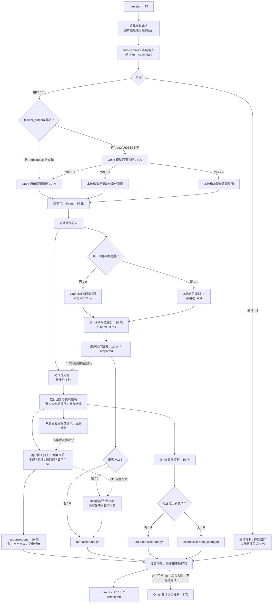
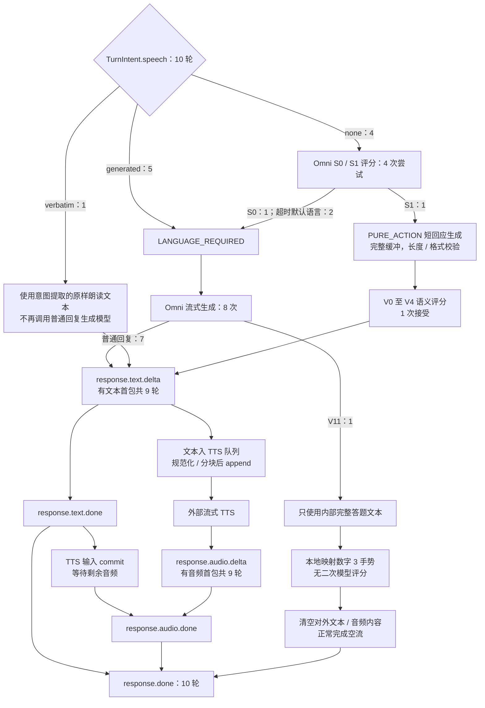
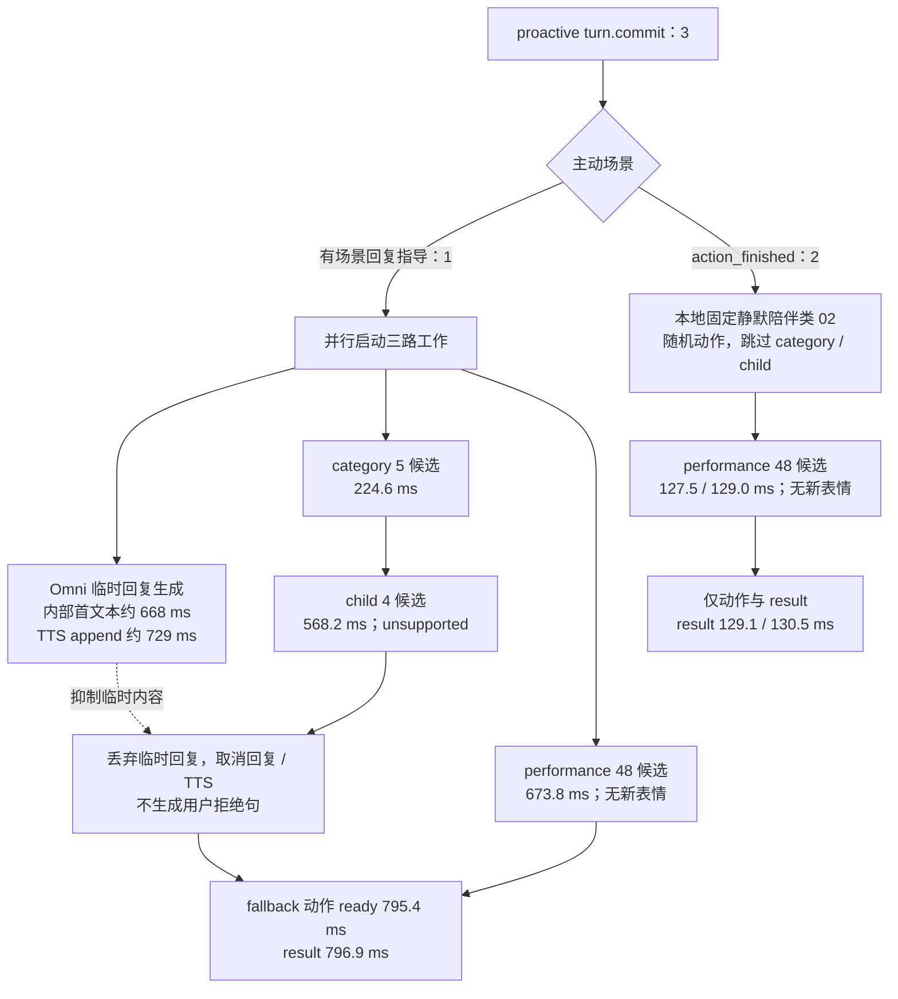

# SGLang-Omni：指定 Session 全链路与耗时实测

> 本文的唯一统计范围为 **`sess_ee2fb602` 与 `sess_bb618c1b`**，共 13 个已提交 Turn。时间均为 Asia/Shanghai（UTC+8）。两个 Session 不属于同一连续一小时窗口，也不属于同一服务进程。
>
> 日志用于确认实际路径和耗时，源码用于解释输入、输出与缓存边界。流程图只画这两个 Session 实际走到的路径；用户 Turn、主动 Turn、Session 预热分开统计。没有发生的分支不纳入图中或用零耗时填充。

## 1. 先建立整体认识

服务不是“一次调用 Omni，同时得到文字、声音、动作和表情”，而是**多个共享本轮输入的 Omni 请求，经服务端编排，再接外部流式 TTS**。

- 用户 Turn 先取得任务意图，再给动作分支最多约 **1 秒**的优先窗口。动作完成或窗口到期后放行回复与表现控制；到期不会取消动作。
- 动作通常经过“类别召回 → 类别内候选评分”。本样本有 1 次唯一动作别名捷径，**只跳过类别评分，仍做 child 支持性校验**。
- Omni 生成文本，外部 TTS 生成音频。动作、表情、文本和音频分别发布，`turn.result` 是服务端最终收敛结果，不是客户端播放 / 动作执行完成。
- 10 个用户 Turn 中，9 个有实际文本及音频首包；另 1 个是视觉算数手势：内部生成答题文本，再确定性映射数字 3，对外不发文本 / 音频 delta。
- 3 个主动 Turn 均无文本 / 音频 delta：1 个临时回复被动作不支持判定抑制，2 个是动作结束后的静默陪伴。
- 普通用户回复带角色指令与 `provided_context` 知识证据。CURRENT_ONLY 表示本次不转发对话历史，**不是只有音频，也不是没有知识上下文**。

### 1.1 样本范围与分组

| Session | 直接关联日志时间范围 | API / worker PID | 用户 / 主动 Turn | 最终状态 |
|---|---|---|---:|---|
| `sess_bb618c1b` | 2026-09-16 20:11:47.737–20:14:27.685 | `3803188 / 3803684` | 5 / 3 | 8 completed |
| `sess_ee2fb602` | 2026-09-17 00:01:57.716–00:04:57.668 | `836151 / 837321` | 5 / 0 | 5 completed |
| 合计 | 两个独立 Session，不是连续采样窗口 | 两组进程 | **10 / 3** | **13 completed** |

共 13 次 start、13 次 commit、13 次 completed，无整轮 cancelled / failed / partial。存在 1 次 `reply_cancelled`，但那是主动 Turn 的回复子任务被取消，整轮仍正常完成。

两个 Session 都声明 text/audio/expression/action 四种输出模态、hierarchical 动作选择、51 个动作类别与 524 个候选，且 `action_ready_tts_decoupled=true`、`route_action_parallel=true`。这些配置一致不代表各轮输入或实际分支一致。

**统计默认：第 5–6 节主表为 10 个用户 Turn；主动 Turn 在第 9 节单列。** 全部 13 个 Turn 的完整里程碑在第 10 节。样本量小、输入与进程不同，汇总只是描述性统计，不能作为压测、SLA 或版本性能对比结论。

阅读建议：认识系统看第 2–4 节；缓存看第 5 节；延迟看第 6–7 节；状态与主动路径看第 8–9 节；逐轮追溯看第 10–11 节。流程图使用 Mermaid，需支持 Mermaid 的 Markdown 预览器或仓库文档站。

## 2. 总流程图：从 Turn 开始到各路输出

实线表示执行或数据依赖，虚线表示放行条件 / 后台工作。用户分支数字以 10 个用户 Turn 为分母；主动分支单独标为 3 个。并行节点计数不能相加当作 Turn 总数。



门控只判断用户要求的视觉任务范围，本次门控模型不收图片；真正看图发生在后面的动作或回复请求。`sess_bb618c1b` 没有门控事件，不应标成 V00。

动作优先窗口与动作计算重叠；协程并行也不等于 GPU 无等待。动作 ready 代表决策已发送，表情 ready 代表表情指令已发送，均不代表数字人已经执行 / 显示完成。

## 3. 用户回复分支：哪些路径产生首包？



`speech=none` 是初始意图，不保证静音：4 次中有 3 次最终走普通语言生成，另外 1 次纯动作也通过了短回应校验并发出了语音。

原样朗读 Turn 的 commit 没有客户端 `turn.text`，朗读内容由意图解析提取。`provided_reply_used` 是复用发送路径的事件，不代表客户端提供过文本，也不表示额外调用了普通回复模型。

本组用户 Turn 没有动作拒绝、短回应过长或生成失败路径。主动回复被抑制的唯一案例见第 9 节，不应混成用户拒绝回复。

## 4. 节点输入、输出与 Omni 请求组成

### 4.1 各分支不是转发同一个“大 Prompt”

10 个用户 Turn 的 commit 均无 `turn.text`，均有音频与图片，但图片角色不同：

| Session | 用户音频 chunks / Turn | 收到图片 / Turn | 用户普通回复实际转发图片 |
|---|---:|---|---|
| `sess_bb618c1b` | 38–48 | 1 张 `avatar_state` | 0；角色图片被过滤 |
| `sess_ee2fb602` | 68–183 | 5–9 帧，含 `user_camera` 与 `avatar_state` | 4–8 张 `user_camera`；不转发角色图片 |

服务端冻结本轮完整音频，并整理图片时间 / 序号；各分支自行裁剪输入。角色画面描述角色自身，用户摄像头描述用户及环境，两者不能互换。没有独立 ASR 文本节点出现在本次已观测路径中，模型请求直接携带音频。

| 节点 | 输入组成 | 输出及消费者 |
|---|---|---|
| 收集 / commit | 当前音频 chunks、带 role 图像、输出 modalities、候选允许 / 排除约束、已执行动作 / 姿态等状态 | 冻结音频、预处理图片、TurnBuffer；`turn.committed` |
| 视觉范围门控 | 固定门控 system + 当前音频；本次不送图片，也无原始用户文本 | V00 / V01 / V11；5 次，仅 `sess_ee2fb602` |
| 通用意图解析 | 固定意图 system + 当前音频；无角色大 Prompt、知识块、图片或历史 | 7 次结构化 speech、body_mode、body、face、history、reaction、可选 voice tone / pace |
| V01 / V11 本地意图 | 门控结果 + 固定规则，不新增意图模型请求 | 2 次视觉动作指代，1 次视觉答题 |
| 唯一动作别名定位 | 意图 body、候选目录别名与约束 | 1 次定位“双手比心”类别 31，仍进入 child |
| 动作 category | 固定类别定义 + 独立 Session 动作指令 + 意图动作文本 + 当前音频 / 动作图片 + 姿态 / 约束 | 用户 9 次类别或类别集合；候选宽度 6 / 8 / 11 / 51 |
| 动作 child | 选定 / 合并类别的候选定义 + Session 动作指令 + 本轮媒体、意图、姿态和约束 | 用户 10 次 action、candidate、执行绑定、support_status；候选 2 / 8 / 26 / 41 / 149 |
| 动作优先窗口 | 已启动的动作任务 + 约 1 秒 deadline | 完成或到期放行；不调用模型，也不因到期取消动作 |
| S0 / S1 消歧 | 固定分类规则 + 当前音频；无图片、历史、角色大 Prompt | 1 次 S0、1 次 S1、2 次超时回退 LANGUAGE_REQUIRED |
| 用户 performance | 固定表情目录 / scope 规则 + 当前音频 + 意图 action_context；本次无图片 / 历史 | 每次 12 候选；4 次新表情、6 次不改变表情 |
| 语气 / 语速计划 | TurnIntent voice tone / pace，立即释放 future | TTS instruction，不等待表情模型 |
| 普通 / V11 回复 | 角色 system + 服务端规则 + 可用用户图片 + 知识证据 + 意图 + 当前音频 + 姿态 / 视觉 / 语言规则 | 用户 8 次流式生成；7 次对外文本，1 次内部答题 |
| verbatim | 意图解析得到的待朗读文本 | 1 次直接进入文本发送 / TTS，无额外普通回复生成 |
| 纯动作短回应 | 回复构造器去掉图片 / 历史，保留角色、知识、意图、音频和短回应限制 | 1 次完整缓冲短句，格式 / 长度校验后再语义校验 |
| 短回应语义校验 | 固定违规类型 + 当前音频 + 待校验短句；无图片 / 历史 | 1 次 V0–V4 候选评分，接受后才发送 / TTS |
| 数字手势映射 | V11 完整文本 + 数字候选 | 1 次确定性得到数字 3；不调用二阶段模型 |
| 外部 TTS | 文本、语音 / 语气 / 语速配置、会话级连接 | PCM16LE，24 kHz，单声道，及音频结束事件；不是 Omni Talker 输出 |
| 最终收敛 | 回复结果、动作支持性 / 绑定、表情决定和分支状态 | `turn.result`，更新历史与动作状态 |
| 后台记忆 | 固定规则 + active claims / open threads / revision + 本轮音频 / 用户文本 / 序号；不送图片或助手回复正文 | 9 次结构化 claims / episodes / threads 更新，不阻塞 result |

动作 Session 指令不是普通回复 system 的直接复制：它按配置拼接 persona、视觉行为偏好、被动动作策略、类别 / 动作偏好、运行时规则、实体信息等。动作图像保留最新角色帧并限制数量（当前源码上限 8）；是否保留用户图像取决于任务，不是每个节点都消费全部 commit 图片。

用户意图中 `has_body=true` 为 4/10，`has_face=true` 为 0/10；performance scope 为 body_only 4 次、none 6 次。没有明确 face 指令仍可选伴随表情，因此实际发布了 4 次表情。主动请求的不同输入与 48 候选 performance 见第 9 节。

### 4.2 普通回复的实际内容顺序

8 次用户普通 / V11 生成都是 **system + user 两条 messages**，CURRENT_ONLY、历史转发 0 次。不要把诊断日志中脱敏后的 system 占位字符串长度当作真实 Prompt 长度。

| 内容与顺序 | `sess_bb618c1b`：3 次用户生成 | `sess_ee2fb602`：5 次用户生成 |
|---|---|---|
| system | 角色指令 + 服务端回复约束，24,544 字符 | 同类结构，25,816 字符 |
| user 开头 | 直接进入知识证据，没有图片 | 摄像头角色说明 270 字符 → 4–8 张用户图片 |
| 知识与任务 | 知识证据 20,284 字符 → 当前任务优先规则 562 字符 → 任务 JSON 150 字符 | 知识证据 20,284 字符 → 同一优先规则 → 随 Turn 变化的任务 JSON |
| 当前媒体 | 1 个完整音频占位，媒体经 metadata 传入 | 同左；图像已出现在知识块之前 |
| 后续约束 | 姿态记录 210 字符 → 无用户摄像头提示 622 字符 → 语言规则 395 字符 | 姿态记录 210 字符 → 用户摄像头 / 角色区分规则 861 字符 → 语言规则 395 字符 |
| 额外答题规则 | 无 | 仅 V11：操作数输出规则 996 字符 |
| 实际 Prompt tokens | 10,543–10,547，平均 10,545 | 11,592–12,189，平均 11,783.8 |

这些 token 含媒体展开后的输入，字符数不能直接换算为 tokens。8 次请求的采样日志均为 temperature=0.4、top_p=1.0、max_new_tokens=512，输出模态仅 text。

知识来自已提供的 `provided_context`，本地拼入请求；未观察到这些 Turn 在线检索知识 RPC。纯动作短回应复用构造器但去掉图片，并将生成上限设为 48 tokens。主动首轮另有 24,875 字符 system、场景指导和无摄像头提示，不带当前媒体或这段知识块。

### 4.3 模型调用次数：用户与主动分开

| 请求种类 | 用户 Turn | 主动 Turn | 方式与说明 |
|---|---:|---:|---|
| 视觉范围门控 | 5 | 0 | Omni 短生成，输出任务范围 ID |
| 通用 TurnIntent | 7 | 0 | Omni 结构化生成；另 3 轮本地构造意图 |
| category / child | 9 / 10 | 1 / 1 | 共享父前缀下的候选后缀评分 |
| S0 / S1 | 4 次尝试：2 成功、2 超时 | 0 | 两候选评分 |
| performance | 10，每次 12 候选 | 3，每次 48 候选 | 表现控制候选评分 |
| 普通 / V11 流式生成 | 8，均有内部首文本 | 1，有内部首文本后被抑制 | 用户 7 次对外回复、1 次内部答题 |
| 纯动作短回应生成 | 1 | 0 | 内部缓冲后校验 |
| 短回应语义评分 | 1 | 0 | 5 候选，接受 |
| verbatim 额外回复生成 | 0 | 0 | 1 个用户 Turn 直接使用意图文本 |
| 数字手势二阶段模型评分 | 0 | 0 | 唯一数字手势通过确定性映射完成 |
| 拒绝回复生成 | 0 | 0 | 主动 unsupported 只抑制临时回复，未生成拒绝句 |
| 后台记忆抽取 | 9 | 0 | background 请求，不阻塞当前 result |

候选评分先得到一个多模态父前缀，再计算各候选后缀的 log probability，不是每个候选都重算完整 Prompt。当前代码的 admission priority 为 category/child=0、performance=1、S0/S1 与短回应校验=2；同一 GPU 仍存在竞争和调度等待。

## 5. KV cache：边界、实际命中与媒体缓存

### 5.1 三种缓存不是一回事

以下媒体缓存计数仅覆盖用户 Turn 的 category / child / performance 请求。

| 缓存 | 保存什么 | 这两个 Session 的用户请求证据 |
|---|---|---|
| 预处理上下文 | 已处理媒体及预处理上下文 | category 9 次 miss；child 9 次 hit、1 次 miss |
| 媒体 encoder | 音频 / 图像编码结果 | 三阶段音频均 hit；category 图像 9 次 compute，child 图像 9 次 hit、1 次 compute |
| Thinker 前缀 KV | 精确前缀的注意力状态 | 看父前缀已命中 / 本次计算 tokens，不能用 encoder hit 替代 |

`turn_6e19f834_8` 跳过 category，故 child 需要自行预处理和计算图像编码，不能认为 child 永远免编码。其余用户 child 接着 category 复用媒体上下文。

KV 要求命中位置之前的 token、媒体身份、位置编码与缓存 scope 相容。**相同后缀不能跳过变化的前文单独复用**；同一音频出现在不同任务 Prompt 中也不保证整段 KV 可共享。

### 5.2 动作评分的三层边界与实测

```text
动作评分父前缀
┌────────────────────┬────────────────────────┬──────────────────────────┐
│ 已发布且验证通过的目录 │ Session 动作指令等稳定段 │ 当前意图 / 状态 / 媒体等动态段 │
│ public scope        │ session scope          │ request-private scope    │
│ 可跨 Session 共享     │ 只在同一 Session 内共享   │ 只供本请求及其候选共享       │
└────────────────────┴────────────────────────┴──────────────────────────┘
                                                          ↓
                                           同一父前缀 → 多个候选后缀
```

public 不是任意自称“静态”的文本：服务端只接受已发布目录 Prompt，并验证实际 token 前缀。合并类别 / 视觉专用 child Prompt 不一定有 public 段，但仍可在同一 Session 内复用。Session namespace 包含 session instance、stage、origin 与指令 hash，指令或 scope 变化会改变命中条件。

下表仅统计 **10 个用户 Turn** 中实际发生的 score 请求，不把跳过的 category 当作零耗时 / 零 token 请求。

| 阶段 | n | 平均父前缀 tokens | 平均已命中 tokens | 平均本次计算 tokens | 平均逐请求命中率 |
|---|---:|---:|---:|---:|---:|
| category | 9 | 13,003.7 | 11,320.1 | 1,683.6 | 87.2% |
| child | 10 | 9,390.0 | 5,093.2 | 4,296.8 | 55.5% |
| performance | 10 | 783.5 | 0 | 783.5 | 0% |

比例为逐请求 `parent_cache_hit_ratio` 的算术平均，不是两列平均值相除。用户 category 的已验证 public 段均为 6,259 tokens，Session 可复用边界平均约 11,974.4 tokens。child 的目录、组合和命中状态更不一致，不能假定每轮全热。

**`prefix_cached=true` 不等于父前缀跨 Turn 命中。** 它在评分结果中确认候选复用了本次父前缀。两 Session 共 34 个有明确 Turn 的 category / child / performance score 请求（用户 29、主动 5），候选前缀重算 tokens 全为 0；但部分父前缀仍需大量计算。

用户 performance 的父 KV 为什么为 0：其专用 Prompt 不属于已发布 public 动作目录，请求又含音频，且没有 category / child 那种独立验证的 Session instruction 边界，因此当前实现限制了跨请求共享范围。**这不等于所有 performance 都无法命中**：两个无媒体主动请求各命中了 1,237/1,249 tokens，见第 9 节。S0/S1 与短回应校验也须按实际边界判断，本文没有为它们虚构逐请求命中率。

### 5.3 普通生成：知识块的位置决定可复用长度

普通生成使用 Session owner 隔离的私有 cache key，不把角色、知识或用户媒体当作跨 Session 的公共前缀。门控、通用意图、回复与记忆等任务的 system 不同，不能因为使用同一音频就视为共享整段 KV。

- `sess_bb618c1b` 的回复没有图片，稳定知识块位于当前音频之前，有机会随连续前缀一起复用。
- `sess_ee2fb602` 是“角色 system → 当前摄像头图片 → 知识块 → 当前音频”。变化的图片打断前缀，知识块即使完全相同，也不能绕过图片单独命中。

以下通过 `reply_prompt_rendered` 与该 request **第一次** `gpu_physical_batch_selected.members` 联合核实，覆盖 8 次用户普通 / V11 生成。

| Session / Turn | Prompt tokens | 首次调度已有 KV | 本次需 prefill tokens | prefill 批次数 | 提交 → 内部首文本 ms |
|---|---:|---:|---:|---:|---:|
| bb / `turn_87903d8e_3` | 10,547 | 4,762 | 5,785 | 6 | 631.1 |
| bb / `turn_dec25ee4_11` | 10,543 | 10,282 | 261 | 1 | 130.8 |
| bb / `turn_86137b31_13` | 10,545 | 10,269 | 276 | 1 | 135.1 |
| ee / `turn_f54bb7a8_1` | 11,667 | 3 | 11,664 | 13 | 1,149.0 |
| ee / `turn_bf9ef823_3` | 11,592 | 5,064 | 6,528 | 8 | 1,105.6 |
| ee / `turn_a6fee829_4` | 11,594 | 5,064 | 6,530 | 7 | 693.1 |
| ee / `turn_6ece7dc3_6` | 11,877 | 5,064 | 6,813 | 8 | 1,055.4 |
| ee / `turn_d33bf4f5_7` | 12,189 | 5,064 | 7,125 | 7 | 824.4 |

bb / ee 分别指本文两个完整 Session ID。bb 后两次约 97%–98% 的前缀已有 KV，ee 后四次只复用了前面的 5,064 tokens；这与输入排序相符。**不是受控实验，不能把全部首文本差异都归因于缓存**，还存在媒体处理、调度与负载差异。

分块 prefill 后续 batch 的 cached_tokens 会增长，包含本请求刚计算的前缀，不能重复算成跨 Turn 命中。图像 / 音频 encoder 命中也不意味着它们之后的 Thinker KV 已经可复用。

## 6. 节点耗时与实际输出

### 6.1 统一统计口径

- 主表覆盖这两个 Session 的 **10 个用户 Turn**，主动 3 个在第 9 节单列。后台记忆 9 次都归属用户 Turn。
- 单位 ms。累计耗时从服务端 `turn_commit_received` 的同机 `monotonic_ns` 做差，不是用户开始说话、VAD 停止或客户端发包时刻。
- 首包取实际 `ws_event_sent.ws_event_type`，不拿内部 provisional 标记代替发送。
- n 是实际存在该指标的请求数。没有首包记为“—”，不当作 0；跳过模型阶段也不计入其平均耗时。
- P90 为排序后线性插值。不同分支的 n、执行重叠和计时包含关系不同，不可把均值 / P90 简单相加还原总时长。

### 6.2 节点自身 / 相邻节点耗时

| 节点或区间 | n | 平均 ms | P90 ms | 如何理解 |
|---|---:|---:|---:|---|
| turn.start 接收 → commit 接收 | 10 | 3,344.4 | 6,575.0 | 包括用户输入采集，不是推理延迟 |
| commit 后等图片预处理 | 10 | 0.028 | 0.032 | 大部分提前完成，非图像 encoder 总耗时 |
| 视觉范围门控 | 5 | 94.2 | 101.0 | 仅 ee 的 5 轮 |
| TurnIntent 总阶段 | 10 | 244.8 | 383.6 | ee 的 5 轮已包含门控；bb 无门控 |
| V00 门控完成 → 通用意图 ready | 2 | 330.0 | 370.0 | 上一行的子区间，不是额外全阶段 |
| 动作优先窗口等待 | 10 | 794.7 | 1,001.6 | 与动作计算重叠；5 次提前完成、5 次到期 |
| category score | 9 | 450.3 | 545.5 | 不计 1 次别名捷径；含排队、预处理、推理 |
| child score | 10 | 798.3 | 1,732.3 | 可有多个 suffix batch；非纯 GPU kernel 时间 |
| S0/S1 成功 | 2 | 235.9 | 326.2 | 1 次语言、1 次纯动作 |
| S0/S1 超时回退 | 2 | 501.8 | 501.8 | 约 500 ms 截止后进入语言路径 |
| performance score | 10 | 590.0 | 1,666.0 | 含竞争与等待 |
| 普通 / V11 request 构造 | 8 | 0.341 | 0.380 | 本地组装，非模型 prefill |
| 普通 / V11 提交 → 内部首文本 | 8 | 715.6 | 1,118.6 | 包含不对外发文本的 V11 |
| 纯动作短回应 `generation_ms` | 1 | 483.2 | 483.2 | 包括校验和后续 provided-text / TTS，不是纯生成时间 |
| 短回应语义校验 | 1 | 100.8 | 100.8 | 上一行内部的 5 候选评分 |
| V11 等待完整回复 | 1 | 760.2 | 760.2 | 不是第二次模型评分 |
| TTS 首文本入队 → 首 append | 9 | 38.4 | 60.5 | 文本分块 / 缓冲和本地处理 |
| TTS 首 append → 首 PCM | 9 | 247.4 | 411.4 | 外部 TTS 链路墙钟，含网络等因素 |
| TTS 首文本入队 → 首 PCM | 9 | 285.8 | 431.1 | 前两区间的整体 |
| 表情决定 → 发布 | 4 | 0.165 | 0.261 | 本地发布开销 |
| response.done → turn.result | 10 | 0.478 | 0.515 | 这些用户样本最终收尾很短 |
| 后台记忆抽取 | 9 | 322.4 | 368.5 | 不阻塞当前 result；另有平均约 0.7 ms 入队等待 |

图片预处理 worker 每用户 Turn 合计平均 2.6 ms，主要与采集重叠，不应与 commit 等待混淆。音频冻结、别名匹配、候选本地过滤、知识拼接、voice future 释放等没有独立完整计时，包含在相邻阶段墙钟内；“未单独测量”不是 0 ms。

唯一数字映射的决策日志 elapsed_ms=0.0，表示没有调用数字评分模型，不表示本地提取 / 映射 / 发布绝对零开销。

### 6.3 从 commit 到用户 Turn 实际输出

| 里程碑 | n | 平均 ms | P90 ms | 边界 |
|---|---:|---:|---:|---|
| TurnIntent ready | 10 | 245.4 | 384.3 | 服务内部结果 |
| 优先窗口放行 | 10 | 1,040.2 | 1,386.3 | 回复 / 表情可开始 |
| `turn.action.ready` | 10 | 1,543.4 | 2,509.2 | 动作决策已发送 |
| `turn.expression.ready` | 4 | 1,510.9 | 2,152.5 | 仅有新表情的样本 |
| `response.text.delta` 首包 | 9 | 1,790.8 | 2,788.6 | 实际文本流，不含 V11 内部文本 |
| `response.audio.delta` 首包 | 9 | 2,076.6 | 3,027.0 | 首段 PCM 已发送 |
| `response.text.done` | 10 | 2,090.7 | 3,148.3 | 含 V11 空流 |
| `response.audio.done` | 10 | 5,339.8 | 12,342.0 | 含 V11 空流，不是客户端播放完成 |
| `response.done` | 10 | 5,339.9 | 12,342.1 | 回复流结束 |
| `turn.result` | 10 | 5,340.4 | 12,342.7 | 用户 Turn 收敛 |

按 Session 分看用户 Turn 的均值，避免掩盖输入和分支差异：

| 用户样本 | 文本首包 ms | 音频首包 ms | 动作 ready ms | result ms |
|---|---:|---:|---:|---:|
| bb：5 个用户 Turn | 1,143.8（n=5） | 1,456.7（n=5） | 908.8（n=5） | 5,954.3（n=5） |
| ee：5 个用户 Turn | 2,599.6（n=4） | 2,851.4（n=4） | 2,178.1（n=5） | 4,726.5（n=5） |

bb 有 58.48 秒音频长回复，ee 有 29.8 秒音频长回复，会显著抬高 result 均值。**首包与整段输出结束是不同问题。** 这些指标均不包含客户端网络接收、播放器缓冲、数字人首帧或动作执行完成延迟。

### 6.4 用户 score 请求内部拆解

以下为阶段均值，单位 ms，字段有包含关系，**不能横向求和**。

| 字段 | category（9） | child（10） | performance（10） |
|---|---:|---:|---:|
| 整个 score elapsed | 450.3 | 798.3 | 590.0 |
| admission 动作槽等待 | 0.026 | 0.022 | 123.3 |
| preprocessing | 71.2 | 54.4 | 7.4 |
| audio encoder | 0.299 | 0.272 | 0.278 |
| image encoder | 26.2 | 1.7 | 不适用 |
| scheduler 累计等待 | 15.4 | 147.1 | 261.1 |
| prefix prefill 墙钟 | 234.4 | 415.7 | 95.5 |
| suffix batch 总墙钟 | 66.1 | 245.3 | 288.7 |
| 其中 suffix batch 排队 | 13.6 | 145.4 | 220.7 |

`scheduler_wait_ms` 包括 suffix 排队，`suffix_batch_ms` 本身也包含该 batch 排队。prefix prefill 从首次前缀调度到完成计时，可能包含分块调度间隔，不能解释成纯 GPU 计算。不同请求的“compute_ms”名字也不保证排除了等待。

## 7. 重点 Turn：耗时花在哪里？

### 7.1 `sess_ee2fb602` 最早指定的四个 Turn

以下均为 commit 后实际对外协议时间，单位 ms。

| Turn | 实际路径 | 文本首包 | 音频首包 | 动作 ready | 表情 ready | result |
|---|---|---:|---:|---:|---:|---:|
| `turn_bf9ef823_3` | V01；S0/S1 超时后走语言 | 2,702.3 | 2,936.3 | 3,086.3 | — | 3,489.3 |
| `turn_a6fee829_4` | V01；S0 判语言 | 2,128.8 | 2,388.3 | 1,319.1 | — | 11,225.1 |
| `turn_6ece7dc3_6` | V00；通用意图后生成 | 2,433.1 | 2,691.2 | 2,445.1 | 2,445.6 | 3,060.7 |
| `turn_d33bf4f5_7` | V11；内部答题 → 数字手势 | — | — | 1,855.6 | — | 1,856.2 |

| Turn | 意图阶段（含门控） | 优先窗口等待 | S0/S1 | category / child | child 父 KV：命中 / 本次计算 tokens |
|---|---:|---:|---:|---:|---:|
| `turn_bf9ef823_3` | 91.8 | 1,001.5 | 501.8，超时 | 381.7 / 2,609.0 | 359 / 13,519 |
| `turn_a6fee829_4` | 84.8 | 1,000.3 | 348.7 | 382.8 / 847.9 | 12,299 / 1,600 |
| `turn_6ece7dc3_6` | 372.8 | 1,002.0 | 不需额外调用 | 434.4 / 1,635.0 | 360 / 8,940 |
| `turn_d33bf4f5_7` | 101.3 | 834.4，提前完成 | 不需额外调用 | 454.5 / 378.1 | 7,933 / 1,383 |

- **`bf9ef823_3`：child 是明显长段。** 149 候选、父前缀命中少，prefill 墙钟约 1,312.9 ms，累计调度等待约 634.1 ms，三个 suffix batch 总墙钟约 983.5 ms。回复还经历约 500 ms 的 S0/S1 超时回退。上述重叠字段不能全部相加。
- **`a6fee829_4`：首包不慢，收尾长。** child 复用 12,299 tokens，2.39 秒已有音频首包；result 到 11.23 秒，主要长尾在持续 TTS 输出。生成音频媒体长度为 **29.8 秒**，不是服务端首包延迟或已观测到的用户播放耗时。
- **`6ece7dc3_6`：意图、child 前缀和调度均有贡献。** 意图 372.8 ms；child 仅命中 360 tokens，本次计算 8,940 tokens，prefill 770.1 ms、累计调度等待 671.4 ms。动作和表情约 2.45 秒发布，不代表模型一次性同时输出了二者。
- **`d33bf4f5_7`：无文本 / 音频首包是预期路径。** 动作优先窗口约 834 ms 完成后放行回复，数字动作阶段再等待完整答题文本 760.2 ms，确定性映射数字 3。不是 TTS 故障，也不是首包耗时为零。

### 7.2 `sess_bb618c1b` 的五个用户 Turn

节点自身耗时如下，单位 ms。无视觉门控事件；所有用户输入只有 1 张角色图像，没有用户摄像头图片。

| Turn | 通用意图 | 优先窗口 | category | child | performance |
|---|---:|---:|---:|---:|---:|
| `turn_87903d8e_3` | 331.9 | 629.5，完成 | 378.9 | 248.3 | 173.7 |
| `turn_05f86b04_5` | 255.2 | 1,001.0，到期 | 370.5 | 743.1 | 210.9 |
| `turn_6e19f834_8` | 241.4 | 210.1，完成 | 跳过 | 207.2 | 175.8 |
| `turn_dec25ee4_11` | 245.0 | 611.1，完成 | 359.0 | 250.3 | 133.9 |
| `turn_86137b31_13` | 243.3 | 656.7，完成 | 381.1 | 273.3 | 138.8 |

| Turn | child 候选数 | 父 KV：命中 / 本次计算 tokens | 首 append → 首 PCM ms | 输出音频媒体长度 ms |
|---|---:|---:|---:|---:|
| `turn_87903d8e_3` | 41 | 7,349 / 519 | 397.1 | 1,760 |
| `turn_05f86b04_5` | 26 | 359 / 7,450 | 468.8 | 800 |
| `turn_6e19f834_8` | 2 | 7,575 / 512 | 217.4 | 560 |
| `turn_dec25ee4_11` | 41 | 7,349 / 659 | 168.8 | 1,520 |
| `turn_86137b31_13` | 41 | 7,349 / 656 | 198.9 | 58,480 |

该 Session 的 5 个用户 Turn 都记录 `tts_connection_reused`，不能直接把前两次较长的 TTS 首包等待解释成“首次建立 WebSocket”。当前日志只定位到外部 TTS 链路，不能进一步精确拆解远端排队、合成、网络各占多少。

- `05f86b04_5` 是 verbatim，无额外普通回复模型调用；child 前缀较冷，prefill 603.1 ms 是其 743.1 ms child 长段的主要组成，优先窗口先到期放行了朗读。
- `6e19f834_8` 的“双手比心”别名捷径仅跳过 category。child 用 2 候选校验；S0/S1 耗时 123.1 ms 判纯动作，短回应语义校验 100.8 ms 接受后才发文本 / 音频。
- `87903d8e_3` 普通回复需 prefill 5,785 tokens；`dec25ee4_11` 只需 261 tokens，提交到首文本分别为 631.1 / 130.8 ms。对应缓存差异见第 5.3 节，不把全部时间差都归因于缓存。

### 7.3 `turn_86137b31_13`：22.4 秒结束，不等于 22.4 秒首包

| 事件 | commit 后时间 ms |
|---|---:|
| 动作已发布 | 900.5 |
| 实际文本首包 | 1,037.4 |
| 实际音频首包 | 1,296.6 |
| 文本生成完成 | 2,331.5 |
| TTS 文本输入 commit | 2,332.0 |
| 最后一段音频发出 | 22,399.8 |
| TTS 流完成 | 22,399.8 |
| turn.result | 22,400.6 |

Omni 输出 152 个 completion tokens，音频为 58,480 ms、2,807,040 bytes、234 个 chunk，符合 24 kHz / 单声道 / PCM16 数据量。文本生成完到 TTS 完成还有 **20,068.3 ms**。

234 个音频 delta 从 1,296.6 ms 持续到 22,399.8 ms，相邻事件最大间隔约 **610.5 ms**，没有 20 秒完全不发音频的服务端空档。因此长段是**长音频的持续输出与收尾**，不是动作卡住、Omni 首包等了 22 秒或服务器直到最后才出声。58.48 秒只是可播放音频长度，不是本服务已观测到的用户播放完成时间。

## 8. 结束状态：业务上的“结束”不止一个

本节覆盖两个 Session 的**全部 13 个 Turn**。

| 状态 / 事件 | 数量 | 正确含义 |
|---|---:|---|
| 文本 delta / 音频 delta | 各 9 个 Turn | 都来自用户 Turn；其余不以 0 计首包 |
| 动作 ready | 13 | 10 个用户动作、3 个主动动作决策已发送 |
| 表情 ready | 4 | 全部来自用户 Turn |
| 表情不改变 | 9 | 6 个用户 + 3 个主动，不是失败 |
| response.done | 10 | 全部用户 Turn，含 V11 空回复流 |
| turn.result completed | 13 | 所有 Turn 服务端收敛，不保证每种模态非空 |
| action supported / unsupported | 12 / 1 | 唯一 unsupported 是主动首轮；应用 fallback，仍 completed |
| text=suppressed | 3 | 主动抑制 1 次、静默陪伴 2 次 |
| reply_cancelled | 1 | 主动回复子任务被取消，不是整轮取消 |
| 整轮 cancelled / failed / partial | 0 / 0 / 0 | 不在流程图中虚构未出现的失败路径 |

13 个 result 的输出组合为：4 个四路 completed；6 个 text/audio/action completed、expression not_changed；3 个 text suppressed、audio/action completed、expression not_changed。

V11 的 text/audio 仍可标 completed，实际却没有 delta，因为内部内容被清空后正常完成空流。主动静默 / 抑制的 audio 也为 completed，但未发 PCM。**状态表示分支收尾，不等于确实说了话。**

这两个 Session 未观察到明确面部指令、数字手势二阶段模型评分、回复历史注入、在线知识检索、用户拒绝句生成或客户端预录拒绝音频路径；这些代码能力不能算成本样本实际路径。原样朗读和唯一动作别名捷径则确实发生，已纳入第 2–4 节。

## 9. 主动 Turn 与 Session 预热

### 9.1 两个 Session 的准备阶段

| Session | category 前缀预填充 ms | child 预热阶段 ms |
|---|---:|---:|
| `sess_bb618c1b` | 699.2 | 6,266.8 |
| `sess_ee2fb602` | 654.4 | 6,018.7 |
| 平均（n=2） | 676.8 | 6,142.8 |

这些阶段发生在各自首个 commit 前，不应加进每轮延迟。两个 Session 各有一次可选 child 预热跳过，原因为 `optional_prefill_unavailable_or_over_budget`，不是业务 Turn 失败。

预热不保证每个 child 全热：实际目录组合、视觉专用 Prompt、Session 边界与 token 一致性仍决定命中。全局目录预热不属于本次 13 个业务 Turn 的耗时样本。

### 9.2 三个主动 Turn 的实际路径

全部来自 `sess_bb618c1b`，不运行用户意图解析或动作优先等待窗口。主动首轮没有当前音频 / 图片，有场景回复指导和 4 个允许动作；另外两轮 commit 各有角色图像，但没有音频，performance 请求不使用这些图片。



`turn_df987c3f_1` 在约 795.3 ms 因 child unsupported 丢弃临时回复，之后有 `reply_cancelled`。虽然内部记录 first text、TTS append，实际协议没有文本 / 音频 delta 或 response.done，最终仍是 completed。这就是必须使用实际协议事件计首包的原因。

主动 performance 每次 48 候选、不含媒体。首轮父前缀命中为 0/1,249 tokens；后两次各命中 **1,237/1,249 tokens**，仅计算 12 tokens。它们和用户含音频的 12 候选 performance 不是同一缓存场景。

| 主动里程碑 | n | 平均 ms | P90 ms |
|---|---:|---:|---:|
| 动作 ready | 3 | 351.6 | 662.4 |
| turn.result | 3 | 352.2 | 663.6 |
| 文本 / 音频首包 | 0 | — | — |

两个静默陪伴 Turn 快，并不代表完全没有模型调用；它们仍运行 performance。此处不将静默主动 Turn 加入用户响应均值。

## 10. 完整逐 Turn 里程碑表

仅列本文两个 Session，共 **13 行，对应 13 个 committed Turn**。单位 ms，以各自服务端 commit 为 T0，取实际协议发送事件；“—”表示未出现，不是 0。13 个 result 均 completed。

### `sess_bb618c1b`

此 Session 没有视觉门控事件，故以实际来源 / 回复路径标记，不填 V00。

| Turn | 来源 / 回复路径 | 文本首包 | 音频首包 | 动作 ready | 表情 ready | result |
|---|---|---:|---:|---:|---:|---:|
| `turn_df987c3f_1` | 主动；临时回复被抑制 | — | — | 795.4 | — | 796.9 |
| `turn_87903d8e_3` | 用户；generated | 1,595.1 | 2,016.5 | 962.1 | 1,137.4 | 2,586.4 |
| `turn_05f86b04_5` | 用户；verbatim | 1,257.9 | 1,727.4 | 1,372.8 | 1,468.6 | 2,062.2 |
| `turn_c7cf4aac_6` | 主动；静默陪伴 | — | — | 128.9 | — | 129.1 |
| `turn_6e19f834_8` | 用户；PURE_ACTION 短回应 | 839.7 | 1,057.4 | 452.0 | — | 1,059.4 |
| `turn_10ad2502_9` | 主动；静默陪伴 | — | — | 130.3 | — | 130.5 |
| `turn_dec25ee4_11` | 用户；generated | 989.2 | 1,185.7 | 856.7 | 992.0 | 1,663.0 |
| `turn_86137b31_13` | 用户；generated 长回复 | 1,037.4 | 1,296.6 | 900.5 | — | 22,400.6 |

### `sess_ee2fb602`

5 个 Turn 均为用户来源。V00 / V01 / V11 的后续行为见第 2–3 节。

| Turn | 门控 / 回复路径 | 文本首包 | 音频首包 | 动作 ready | 表情 ready | result |
|---|---|---:|---:|---:|---:|---:|
| `turn_f54bb7a8_1` | V00；S0/S1 超时后生成 | 3,134.0 | 3,389.8 | 2,184.2 | — | 4,000.9 |
| `turn_bf9ef823_3` | V01；S0/S1 超时后生成 | 2,702.3 | 2,936.3 | 3,086.3 | — | 3,489.3 |
| `turn_a6fee829_4` | V01；S0 判语言后生成 | 2,128.8 | 2,388.3 | 1,319.1 | — | 11,225.1 |
| `turn_6ece7dc3_6` | V00；generated | 2,433.1 | 2,691.2 | 2,445.1 | 2,445.6 | 3,060.7 |
| `turn_d33bf4f5_7` | V11；内部答题后数字手势 | — | — | 1,855.6 | — | 1,856.2 |

## 11. 证据入口、复核方式与限制

### 11.1 本次数据集

直接筛选这两个 session_id 共得到 **3,561 条记录**：bb 为 1,541 条，ee 为 2,020 条。记录数含 Session 准备、协议及镜像诊断，不等于业务请求数。GPU batch 的嵌套成员另用完整 request_id 关联，其他 Session、standby、全局预热和资源采样不加入 Turn 统计。

| Session | 日志目录 | API / worker 文件后缀 |
|---|---|---|
| `sess_bb618c1b` | [2026-09-16/20](../../../logs/realtime/2026-09-16/20/) | `3803188 / 3803684` |
| `sess_ee2fb602` | [2026-09-17/00](../../../logs/realtime/2026-09-17/00/) | `836151 / 837321` |

| 核对内容 | 结构化日志 |
|---|---|
| Session 配置、start / commit / completed | `lifecycle_api_<API PID>_000.jsonl` |
| 实际首包、动作 / 表情、done / result | `protocol_api_<API PID>_000.jsonl` 的 `ws_event_sent` |
| 门控、意图、优先窗口、TTS、score stats | `performance_api_<API PID>_000.jsonl`、`action_api_<API PID>_000.jsonl`、`reply_api_<API PID>_000.jsonl` |
| 回复 messages 组成与记忆抽取 | `diagnostic_api_<API PID>_000.jsonl` |
| Prompt tokens | `diagnostic_preprocessing_<worker PID>_000.jsonl` 的 `reply_prompt_rendered` |
| 首次调度缓存与分块 prefill | `performance_api_<worker PID>_000.jsonl` 的 `gpu_physical_batch_selected.members` |

bb 的关键定位：performance API 文件第 336 行为长轮 TTS 完成、第 341 行为其 turn_timing；reply API 第 5 行为主动回复丢弃，第 16 / 23 行为 provided-text 路径；action API 第 46 行为唯一动作别名捷径；diagnostic API 第 2 / 9 / 13 行为三个用户普通回复的逻辑输入。

在仓库根目录定位日志（诊断文件可能含业务内容，不宜整段复制到对外文档）：

```bash
rg -n --glob '*.jsonl' --no-ignore \
  'sess_bb618c1b|sess_ee2fb602' \
  logs/realtime/2026-09-16/20 logs/realtime/2026-09-17/00
```

复算规则：

1. 以 `(session_id, turn_id)` 关联 API 事件；只纳入这两个 Session 的 13 个 commit。再按 `turn_origin` 分成用户 10 / 主动 3。
2. 对每个 Turn 取第一条目标 `ws_event_sent`，计算 `(目标.monotonic_ns - commit.monotonic_ns) / 1e6`；只有实际存在该目标的样本进入均值 / P90。
3. score 明细只取有明确业务 turn_id 与 stage 的 `action_scoring_completed`，不重复计 client 镜像日志；跳过阶段不当成 0 分数请求。
4. 以完整 `logical_request_id / request_id` 关联 worker。普通生成缓存只取第一次 GPU batch 的已有 KV；本次 prefill tokens 则累计实际 range_end-range_start。
5. 计数不是搜索命中次数；内部 provisional 首文本、reply_cancelled、turn.cancelled、completed / 非空输出各有不同含义。

### 11.2 对照源码

| 主题 | 入口 |
|---|---|
| commit、优先窗口、并发与最终收敛 | [turn_pipeline.py](../../../sglang_omni/serve/realtime/turn_pipeline.py) |
| 视觉门控与共享意图 | [turn_intent.py](../../../sglang_omni/serve/realtime/turn_intent.py) |
| 动作输入裁剪 / Session 指令 | [action/context.py](../../../sglang_omni/serve/realtime/action/context.py) |
| 类别 / child / 别名捷径 | [action/category.py](../../../sglang_omni/serve/realtime/action/category.py) |
| 数字手势映射 | [action/numeric_reply.py](../../../sglang_omni/serve/realtime/action/numeric_reply.py) |
| 回复 Prompt 与图片 / 知识顺序 | [reply/pipeline.py](../../../sglang_omni/serve/realtime/reply/pipeline.py) |
| S0/S1、verbatim、短回应 | [reply/routing.py](../../../sglang_omni/serve/realtime/reply/routing.py)、[reply/generation.py](../../../sglang_omni/serve/realtime/reply/generation.py) |
| 表现控制 | [performance/pipeline.py](../../../sglang_omni/serve/realtime/performance/pipeline.py) |
| 外部 TTS 与 PCM | [reply/tts.py](../../../sglang_omni/serve/realtime/reply/tts.py)、[embedded_tts.py](../../../sglang_omni/serve/realtime/embedded_tts.py) |
| 后台记忆 | [memory/extractor.py](../../../sglang_omni/serve/realtime/memory/extractor.py) |
| KV 边界与隔离 | [preprocessor.py](../../../sglang_omni/models/qwen3_omni/components/preprocessor.py)、[request_builders.py](../../../sglang_omni/models/qwen3_omni/request_builders.py)、[public_prefix.py](../../../sglang_omni/models/qwen3_omni/public_prefix.py)、[scoped_cache.py](../../../sglang_omni/scheduling/sglang_backend/scoped_cache.py) |
| score 与 GPU batch 统计定义 | [omni_scheduler.py](../../../sglang_omni/scheduling/omni_scheduler.py) |

实现源码基线为 `b45a438`，后续 `43ea5c6` 是文档提交。不能把当前 HEAD 当作两个历史进程已证实的部署 hash；**实际行为以对应 Session 日志为准，源码用于解释与日志相符的机制**。

最后几个边界：`action_child_ready` 是编排汇合标记，可能晚于 child 真正完成甚至动作发布，模型阶段应看 score 事件。TTS 的 `first_audio_received` 日志在 sink 回调后记录，可能略晚于音频发送标记，并非时间倒流。13 个 completed 的 logger health 均为 dropped_records=0、write_errors=0，但不是跨服务完整性证明。本文没有修改服务配置、Prompt 或缓存策略，也不推算客户端 / 数字人播放与执行完成时间。
